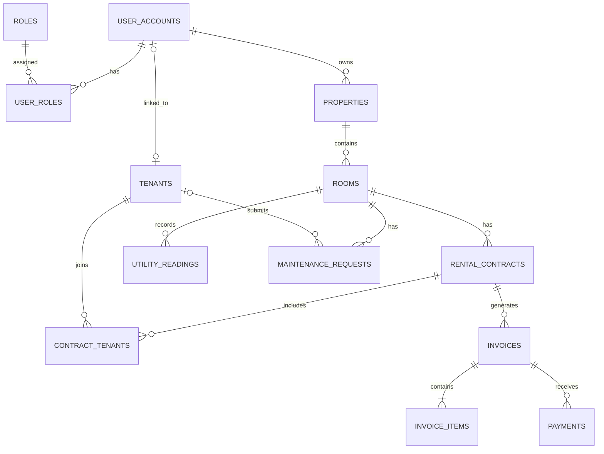

# Database Design

## 1. Design Goals

Database của Rental Management System phải đáp ứng các yêu cầu:

- Quản lý được nhiều chủ trọ
- Một chủ trọ có thể sở hữu nhiều khu trọ
- Một khu trọ có nhiều phòng
- Quản lý người thuê kể cả khi họ chưa có tài khoản đăng nhập
- Một hợp đồng có thể có nhiều người thuê
- Quản lý điện, nước theo từng tháng
- Quản lý hóa đơn và nhiều lần thanh toán
- Lưu được lịch sử dữ liệu
- Hỗ trợ mở rộng trong tương lai

---

## 2. Core Design Decisions

### 2.1. Authentication và tenant được tách riêng

Bảng `user_accounts` dùng để:

- Đăng nhập
- Lưu mật khẩu đã mã hóa
- Quản lý trạng thái tài khoản
- Phân quyền người dùng

Bảng `tenants` dùng để:

- Lưu thông tin người thuê
- Lưu CCCD hoặc giấy tờ tùy thân
- Lưu lịch sử thuê phòng
- Cho phép tạo tenant trước khi có tài khoản đăng nhập

Một tenant có thể liên kết với một user account hoặc chưa liên kết với tài khoản nào.

### 2.2. Landlord không cần bảng riêng trong MVP

Landlord là một user account có vai trò `LANDLORD`.

Bảng `properties` sẽ chứa khóa ngoại `landlord_id` trỏ đến bảng `user_accounts`.

### 2.3. Hợp đồng và người thuê là quan hệ nhiều-nhiều

Một hợp đồng có thể có nhiều người thuê.

Một người thuê có thể tham gia nhiều hợp đồng theo thời gian.

Bảng trung gian `contract_tenants` được sử dụng để biểu diễn quan hệ này.

### 2.4. Hóa đơn chứa nhiều khoản phí

Bảng `invoices` lưu thông tin chung của hóa đơn.

Bảng `invoice_items` lưu từng khoản phí như:

- Tiền phòng
- Tiền điện
- Tiền nước
- Phí dịch vụ
- Khoản phí khác

### 2.5. Một hóa đơn có thể có nhiều lần thanh toán

Bảng `payments` lưu từng giao dịch thanh toán.

Ví dụ hóa đơn 5.000.000 đồng có thể được thanh toán:

- Lần 1: 3.000.000 đồng
- Lần 2: 2.000.000 đồng

---

## 3. Table Overview

| Table | Purpose |
|---|---|
| `roles` | Danh sách vai trò ADMIN, LANDLORD và TENANT |
| `user_accounts` | Tài khoản đăng nhập của người dùng |
| `user_roles` | Liên kết tài khoản với vai trò |
| `properties` | Thông tin khu trọ |
| `rooms` | Thông tin phòng |
| `tenants` | Thông tin người thuê |
| `rental_contracts` | Thông tin hợp đồng thuê |
| `contract_tenants` | Liên kết hợp đồng với người thuê |
| `utility_readings` | Chỉ số điện nước theo tháng |
| `invoices` | Thông tin chung của hóa đơn |
| `invoice_items` | Các khoản phí trong hóa đơn |
| `payments` | Lịch sử thanh toán |
| `maintenance_requests` | Yêu cầu sửa chữa |

---

## 4. Table Responsibilities

### 4.1. roles

Lưu các vai trò trong hệ thống:

- ADMIN
- LANDLORD
- TENANT

### 4.2. user_accounts

Lưu thông tin cần thiết cho việc đăng nhập:

- Email
- Mật khẩu đã mã hóa
- Họ tên
- Số điện thoại
- Trạng thái tài khoản

Không lưu mật khẩu dưới dạng văn bản thông thường.

### 4.3. user_roles

Là bảng trung gian giữa `user_accounts` và `roles`.

Một tài khoản có thể được gán một hoặc nhiều vai trò trong tương lai.

### 4.4. properties

Lưu thông tin khu trọ:

- Chủ trọ
- Tên khu trọ
- Địa chỉ
- Mô tả
- Trạng thái

Một property thuộc về một landlord.

### 4.5. rooms

Lưu thông tin phòng:

- Khu trọ
- Số phòng
- Diện tích
- Giá thuê mặc định
- Tiền đặt cọc mặc định
- Số người tối đa
- Trạng thái phòng

Một room chỉ thuộc về một property.

### 4.6. tenants

Lưu thông tin người thuê:

- Tài khoản đăng nhập nếu có
- Họ tên
- Ngày sinh
- Số điện thoại
- Email
- Số giấy tờ tùy thân
- Địa chỉ thường trú
- Trạng thái

### 4.7. rental_contracts

Lưu thông tin hợp đồng:

- Phòng
- Mã hợp đồng
- Ngày bắt đầu
- Ngày kết thúc
- Giá thuê
- Tiền đặt cọc
- Trạng thái hợp đồng

Một phòng có thể có nhiều hợp đồng trong lịch sử nhưng không được có hai hợp đồng đang hoạt động cùng thời điểm.

### 4.8. contract_tenants

Liên kết người thuê với hợp đồng.

Bảng này có thể lưu thêm:

- Người thuê chính
- Ngày chuyển vào
- Ngày chuyển ra

### 4.9. utility_readings

Lưu chỉ số điện nước của một phòng theo từng tháng:

- Chỉ số điện cũ
- Chỉ số điện mới
- Đơn giá điện
- Chỉ số nước cũ
- Chỉ số nước mới
- Đơn giá nước
- Tháng và năm ghi nhận

Mỗi phòng chỉ có một bản ghi điện nước trong một tháng.

### 4.10. invoices

Lưu thông tin chung của hóa đơn:

- Hợp đồng
- Tháng lập hóa đơn
- Ngày đến hạn
- Tổng tiền
- Số tiền đã thanh toán
- Trạng thái

### 4.11. invoice_items

Lưu từng khoản tiền trong hóa đơn:

- Loại khoản phí
- Mô tả
- Số lượng
- Đơn giá
- Thành tiền

Ví dụ:

| Loại | Số lượng | Đơn giá | Thành tiền |
|---|---:|---:|---:|
| RENT | 1 | 3.000.000 | 3.000.000 |
| ELECTRICITY | 120 | 3.500 | 420.000 |
| WATER | 8 | 20.000 | 160.000 |

### 4.12. payments

Lưu từng lần thanh toán:

- Hóa đơn
- Số tiền
- Thời gian thanh toán
- Phương thức thanh toán
- Mã giao dịch
- Ghi chú

### 4.13. maintenance_requests

Lưu yêu cầu sửa chữa:

- Phòng
- Người thuê gửi yêu cầu
- Tiêu đề
- Nội dung
- Mức độ ưu tiên
- Trạng thái
- Thời gian hoàn thành

---

## 5. Relationships

- Một user account có thể có nhiều role
- Một role có thể thuộc nhiều user account
- Một landlord có thể sở hữu nhiều property
- Một property có thể chứa nhiều room
- Một room có thể có nhiều rental contract theo thời gian
- Một rental contract có thể có nhiều tenant
- Một tenant có thể tham gia nhiều rental contract
- Một room có nhiều utility reading
- Một rental contract có nhiều invoice
- Một invoice có nhiều invoice item
- Một invoice có nhiều payment
- Một room có nhiều maintenance request
- Một tenant có thể gửi nhiều maintenance request

---

## 6. Initial ERD

 ## 7. Important Constraints

Các constraint dưới đây giúp bảo đảm dữ liệu trong database luôn hợp lệ và nhất quán.

### 7.1. User Account Constraints

- Email đăng nhập không được trùng giữa các tài khoản
- Email không được để trống
- Mật khẩu phải được mã hóa trước khi lưu vào database
- Không lưu mật khẩu dưới dạng văn bản thông thường
- Tài khoản bị khóa hoặc ngừng hoạt động không được đăng nhập
- Một tài khoản có thể được gán một hoặc nhiều vai trò
- Mỗi vai trò chỉ được gán một lần cho cùng một tài khoản

### 7.2. Property Constraints

- Mỗi property phải thuộc về một landlord hợp lệ
- Tên property không được để trống
- Địa chỉ property không được để trống
- Property đã ngừng hoạt động không được tạo thêm phòng mới
- Không xóa trực tiếp property nếu đã có phòng hoặc hợp đồng liên quan

### 7.3. Room Constraints

- Mỗi room phải thuộc về một property
- Số phòng không được trùng trong cùng một property
- Hai property khác nhau có thể có cùng số phòng
- Giá thuê mặc định không được âm
- Tiền đặt cọc mặc định không được âm
- Diện tích phòng phải lớn hơn 0
- Số người tối đa phải lớn hơn 0
- Phòng đang có hợp đồng hoạt động không được chuyển sang trạng thái AVAILABLE
- Phòng đang sửa chữa không được tạo hợp đồng thuê mới

### 7.4. Tenant Constraints

- Họ tên người thuê không được để trống
- Số giấy tờ tùy thân không được trùng
- Một tenant chỉ được liên kết với tối đa một user account
- Một user account chỉ được liên kết với tối đa một tenant
- Tenant không được xem thông tin của tenant khác
- Không xóa trực tiếp tenant nếu đã có lịch sử hợp đồng
- Tenant không còn thuê phòng được chuyển sang trạng thái INACTIVE thay vì xóa dữ liệu

### 7.5. Rental Contract Constraints

- Mỗi hợp đồng phải thuộc về một room
- Mã hợp đồng không được trùng
- Ngày bắt đầu không được để trống
- Ngày kết thúc phải sau ngày bắt đầu
- Giá thuê không được âm
- Tiền đặt cọc không được âm
- Một hợp đồng phải có ít nhất một tenant
- Một hợp đồng chỉ có một người thuê chính
- Một room không được có hai hợp đồng đang hoạt động trong cùng một khoảng thời gian
- Không được tạo hợp đồng mới cho phòng đang ở trạng thái MAINTENANCE hoặc INACTIVE
- Khi hợp đồng bắt đầu có hiệu lực, trạng thái phòng chuyển thành OCCUPIED
- Khi hợp đồng kết thúc và không còn hợp đồng hoạt động, trạng thái phòng chuyển thành AVAILABLE

### 7.6. Contract Tenant Constraints

- Một tenant không được thêm hai lần vào cùng một hợp đồng
- Mỗi hợp đồng phải có ít nhất một tenant
- Mỗi hợp đồng chỉ có tối đa một tenant được đánh dấu là người thuê chính
- Ngày chuyển vào không được trước ngày bắt đầu hợp đồng
- Ngày chuyển ra không được trước ngày chuyển vào
- Ngày chuyển ra không được sau ngày kết thúc hợp đồng, nếu hợp đồng có ngày kết thúc

### 7.7. Utility Reading Constraints

- Mỗi utility reading phải thuộc về một room
- Mỗi room chỉ có một bản ghi điện nước cho mỗi tháng và năm
- Tháng phải có giá trị từ 1 đến 12
- Chỉ số điện mới không được nhỏ hơn chỉ số điện cũ
- Chỉ số nước mới không được nhỏ hơn chỉ số nước cũ
- Đơn giá điện không được âm
- Đơn giá nước không được âm
- Lượng điện sử dụng bằng chỉ số điện mới trừ chỉ số điện cũ
- Lượng nước sử dụng bằng chỉ số nước mới trừ chỉ số nước cũ

### 7.8. Invoice Constraints

- Mỗi invoice phải thuộc về một rental contract
- Mỗi hợp đồng chỉ có một hóa đơn chính cho mỗi tháng và năm
- Tháng hóa đơn phải có giá trị từ 1 đến 12
- Ngày đến hạn không được trước ngày tạo hóa đơn
- Tổng tiền hóa đơn không được âm
- Số tiền đã thanh toán không được âm
- Số tiền đã thanh toán không được lớn hơn tổng tiền hóa đơn
- Hóa đơn phải có ít nhất một invoice item trước khi được phát hành
- Không được chỉnh sửa các khoản phí của hóa đơn đã thanh toán đầy đủ
- Trạng thái hóa đơn phải được cập nhật dựa trên tổng số tiền đã thanh toán

### 7.9. Invoice Item Constraints

- Mỗi invoice item phải thuộc về một invoice
- Số lượng phải lớn hơn 0
- Đơn giá không được âm
- Thành tiền không được âm
- Thành tiền bằng số lượng nhân với đơn giá
- Tổng các invoice item phải bằng tổng tiền của invoice

### 7.10. Payment Constraints

- Mỗi payment phải thuộc về một invoice
- Số tiền thanh toán phải lớn hơn 0
- Ngày thanh toán không được để trống
- Tổng các lần thanh toán không được vượt quá tổng tiền hóa đơn
- Một mã giao dịch không được sử dụng cho hai payment khác nhau nếu mã giao dịch được cung cấp
- Payment đã ghi nhận không nên bị xóa trực tiếp
- Nếu có sai sót, payment nên được hủy hoặc tạo giao dịch điều chỉnh để giữ lịch sử

### 7.11. Maintenance Request Constraints

- Mỗi maintenance request phải thuộc về một room
- Tenant gửi yêu cầu phải có liên quan đến phòng đó
- Tiêu đề không được để trống
- Nội dung mô tả không được để trống
- Yêu cầu đã hoàn thành phải có thời gian hoàn thành
- Yêu cầu đã bị hủy không được chuyển sang trạng thái IN_PROGRESS
- Thời gian hoàn thành không được trước thời gian tạo yêu cầu

---

## 8. Deferred Tables

Các bảng dưới đây chưa được tạo trong MVP đầu tiên.

Chúng chỉ được bổ sung sau khi các chức năng đăng nhập, quản lý phòng, hợp đồng, hóa đơn và thanh toán đã hoạt động ổn định.

### 8.1. notifications

Dùng để lưu thông báo trong hệ thống, ví dụ:

- Thông báo hóa đơn mới
- Thông báo hợp đồng sắp hết hạn
- Thông báo yêu cầu sửa chữa đã được cập nhật
- Thông báo thanh toán thành công

### 8.2. refresh_sessions — đã triển khai bằng V7

P0 Authentication Session Hardening đã hiện thực hóa nhu cầu này dưới tên
`refresh_sessions`, thay vì bảng `refresh_tokens` dự kiến ban đầu. Migration
`V7__create_refresh_sessions.sql` lưu duy nhất SHA-256 hash của opaque refresh
token, session family, absolute expiry, thời điểm sử dụng/thu hồi và liên kết
đến token kế nhiệm; raw token chỉ tồn tại trong cookie HttpOnly.

Schema vật lý và chính sách rotation/reuse là nguồn sự thật tại
[database-schema.md](database-schema.md#24-refresh_sessions) và
[authentication-security.md](authentication-security.md). Không tạo thêm bảng
`refresh_tokens` trùng chức năng.

### 8.3. audit_logs

Dùng để ghi lại lịch sử thay đổi dữ liệu, ví dụ:

- Người nào sửa hợp đồng
- Người nào thay đổi trạng thái hóa đơn
- Thời gian thay đổi
- Giá trị trước và sau khi thay đổi

### 8.4. file_attachments

Dùng để lưu thông tin file đính kèm, ví dụ:

- Ảnh CCCD
- File hợp đồng
- Ảnh biên lai thanh toán
- Ảnh tình trạng phòng
- Ảnh yêu cầu sửa chữa

File thực tế có thể được lưu trên Cloudinary hoặc dịch vụ lưu trữ khác.

Database chỉ lưu đường dẫn và thông tin của file.

### 8.5. online_payment_transactions

Dùng khi tích hợp thanh toán trực tuyến, ví dụ:

- VNPay
- MoMo
- ZaloPay
- Stripe
- PayPal

Bảng này sẽ lưu trạng thái giao dịch với cổng thanh toán.

### 8.6. employees

Dùng khi chủ trọ cần quản lý nhân viên, ví dụ:

- Nhân viên thu tiền
- Nhân viên bảo trì
- Nhân viên quản lý khu trọ

### 8.7. accounting_records

Dùng cho nghiệp vụ kế toán nâng cao, ví dụ:

- Thu nhập
- Chi phí
- Công nợ
- Lợi nhuận
- Báo cáo tài chính

### 8.8. chat_messages

Dùng cho chức năng trò chuyện trực tiếp giữa landlord và tenant.

Chức năng này chưa cần thiết trong MVP đầu tiên.

### 8.9. Deferred Feature Rule

Không tạo các bảng deferred chỉ vì chúng có thể cần trong tương lai.

Một bảng chỉ được bổ sung khi:

- Chức năng liên quan đã được lên kế hoạch triển khai
- Nghiệp vụ đã được phân tích rõ
- Database hiện tại không đáp ứng được chức năng đó
- Chức năng cốt lõi của MVP đã hoạt động ổn định
