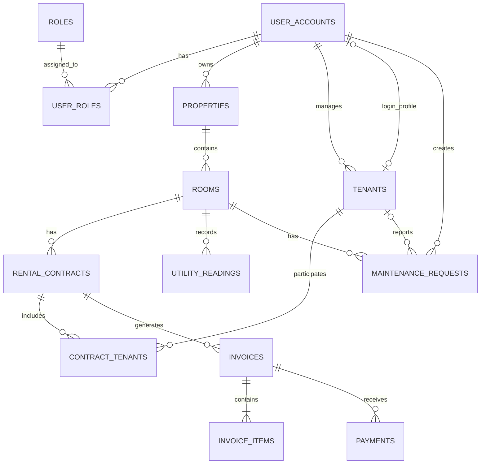

# Physical Database Schema

## 1. Naming and Data Type Conventions

### 1.1. Naming Conventions

* Tên bảng sử dụng dạng số nhiều.
* Tên bảng và tên cột sử dụng `snake_case`.
* Khóa chính của mỗi bảng có tên là `id`.
* Khóa ngoại có dạng `<table_name_singular>_id`.
* Tên bảng phải thể hiện rõ loại dữ liệu được lưu.
* Không sử dụng tên viết tắt khó hiểu.

Ví dụ:

* `user_accounts`
* `rental_contracts`
* `invoice_items`
* `property_id`
* `room_id`
* `invoice_id`

### 1.2. Primary Key Type

Khóa chính của các bảng chính sử dụng kiểu PostgreSQL:

`BIGINT GENERATED BY DEFAULT AS IDENTITY`

Trong Java, kiểu dữ liệu tương ứng là:

`Long`

Không sử dụng `int` cho khóa chính vì số lượng dữ liệu có thể tăng trong tương lai.

### 1.3. Money Type

Các giá trị tiền sử dụng kiểu PostgreSQL:

`NUMERIC(15, 2)`

Trong Java, kiểu dữ liệu tương ứng là:

`BigDecimal`

Không sử dụng `double` hoặc `float` để lưu tiền vì có thể xảy ra sai số.

### 1.4. Date and Time Types

Ngày không cần lưu giờ sử dụng:

`DATE`

Ví dụ:

* Ngày sinh
* Ngày bắt đầu hợp đồng
* Ngày kết thúc hợp đồng
* Ngày đến hạn hóa đơn

Thời điểm cần lưu cả ngày và giờ sử dụng:

`TIMESTAMPTZ`

Ví dụ:

* Thời gian tạo dữ liệu
* Thời gian cập nhật dữ liệu
* Thời gian thanh toán
* Thời gian hoàn thành sửa chữa

### 1.5. Status Type

Trong giai đoạn đầu, các trạng thái được lưu bằng `VARCHAR` kết hợp với `CHECK constraint`.

Ví dụ:

`status VARCHAR(20) NOT NULL CHECK (status IN ('ACTIVE', 'INACTIVE', 'LOCKED'))`

Chưa sử dụng PostgreSQL ENUM để tránh làm Flyway migration và Java mapping phức tạp quá sớm.

### 1.6. Soft Delete

Các dữ liệu quan trọng không bị xóa trực tiếp khỏi database.

Các bảng nghiệp vụ chính có thể sử dụng cột:

`deleted_at TIMESTAMPTZ NULL`

Quy ước:

* `deleted_at IS NULL`: dữ liệu chưa bị xóa.
* `deleted_at IS NOT NULL`: dữ liệu đã bị xóa mềm.

Xóa mềm giúp giữ lại lịch sử tài khoản, hợp đồng, hóa đơn và thanh toán.

---

## 2. Authentication and Authorization Tables

### 2.1. roles

Bảng `roles` lưu danh sách các vai trò trong hệ thống.

| Column        | PostgreSQL Type | Null | Constraint            | Description        |
| ------------- | --------------- | ---- | --------------------- | ------------------ |
| `id`          | `BIGINT`        | No   | Primary Key, Identity | Mã vai trò         |
| `name`        | `VARCHAR(30)`   | No   | Unique                | Tên vai trò        |
| `description` | `VARCHAR(255)`  | Yes  |                       | Mô tả vai trò      |
| `created_at`  | `TIMESTAMPTZ`   | No   | Default current time  | Thời gian tạo      |
| `updated_at`  | `TIMESTAMPTZ`   | No   | Default current time  | Thời gian cập nhật |

Các giá trị vai trò ban đầu:

* `ADMIN`
* `LANDLORD`
* `TENANT`

Constraints:

* `name` không được để trống.
* `name` không được trùng.
* Tên vai trò được lưu bằng chữ in hoa.

Ví dụ dữ liệu:

| id | name     |
| -: | -------- |
|  1 | ADMIN    |
|  2 | LANDLORD |
|  3 | TENANT   |

---

### 2.2. user_accounts

Bảng `user_accounts` lưu thông tin đăng nhập và thông tin cơ bản của người dùng.

| Column           | PostgreSQL Type | Null | Constraint                         | Description                     |
| ---------------- | --------------- | ---- | ---------------------------------- | ------------------------------- |
| `id`             | `BIGINT`        | No   | Primary Key, Identity              | Mã tài khoản                    |
| `email`          | `VARCHAR(255)`  | No   | Unique                             | Email đăng nhập                 |
| `password_hash`  | `VARCHAR(255)`  | No   |                                    | Mật khẩu đã mã hóa              |
| `full_name`      | `VARCHAR(150)`  | No   |                                    | Họ và tên                       |
| `phone`          | `VARCHAR(20)`   | Yes  |                                    | Số điện thoại                   |
| `status`         | `VARCHAR(20)`   | No   | Default `ACTIVE`, Check constraint | Trạng thái tài khoản            |
| `email_verified` | `BOOLEAN`       | No   | Default `FALSE`                    | Email đã được xác minh hay chưa |
| `last_login_at`  | `TIMESTAMPTZ`   | Yes  |                                    | Lần đăng nhập gần nhất          |
| `created_at`     | `TIMESTAMPTZ`   | No   | Default current time               | Thời gian tạo                   |
| `updated_at`     | `TIMESTAMPTZ`   | No   | Default current time               | Thời gian cập nhật              |
| `deleted_at`     | `TIMESTAMPTZ`   | Yes  |                                    | Thời gian xóa mềm               |

Các giá trị hợp lệ của `status`:

* `ACTIVE`
* `INACTIVE`
* `LOCKED`

Constraints:

* `email` không được để trống.
* `email` không được trùng.
* `password_hash` không được để trống.
* Không lưu mật khẩu thông thường trong cột `password_hash`.
* `full_name` không được để trống.
* Tài khoản có trạng thái `LOCKED` không được đăng nhập.

Cột `password_hash` phải chứa mật khẩu đã được mã hóa, không phải mật khẩu thông thường.

Ví dụ đúng:

`$2a$10$...`

Ví dụ sai:

`123456`

Sau này Spring Security sẽ sử dụng BCrypt để mã hóa và kiểm tra mật khẩu.

---

### 2.3. user_roles

Bảng `user_roles` là bảng trung gian giữa `user_accounts` và `roles`.

| Column        | PostgreSQL Type | Null | Constraint           | Description                   |
| ------------- | --------------- | ---- | -------------------- | ----------------------------- |
| `user_id`     | `BIGINT`        | No   | Foreign Key          | Tham chiếu `user_accounts.id` |
| `role_id`     | `BIGINT`        | No   | Foreign Key          | Tham chiếu `roles.id`         |
| `assigned_at` | `TIMESTAMPTZ`   | No   | Default current time | Thời gian gán vai trò         |

Primary Key:

`(user_id, role_id)`

Foreign Keys:

* `user_id` tham chiếu đến `user_accounts.id`.
* `role_id` tham chiếu đến `roles.id`.

Constraints:

* Một vai trò không được gán hai lần cho cùng một tài khoản.
* User account phải tồn tại trước khi được gán role.
* Role phải tồn tại trước khi được gán cho user account.

Bảng `user_roles` không cần cột `id` riêng vì cặp `user_id` và `role_id` đã có thể nhận diện duy nhất một dòng.

Ví dụ:

| user_id | role_id |
| ------: | ------: |
|       5 |       2 |

Dữ liệu này có nghĩa là tài khoản số 5 có vai trò `LANDLORD`.

Database không cho phép thêm lại cùng một cặp `user_id = 5` và `role_id = 2`.

---

## 3. Authentication Relationships

Quan hệ giữa ba bảng:

```text
user_accounts
      1
      |
      N
 user_roles
      N
      |
      1
    roles
```

Quan hệ giữa `user_accounts` và `roles` là quan hệ many-to-many.

Bảng `user_roles` được sử dụng làm bảng trung gian.

Ví dụ:

* Một tài khoản có thể có nhiều vai trò.
* Một vai trò có thể được gán cho nhiều tài khoản.
* Một tài khoản không được có cùng một vai trò hai lần.

Ba bảng đầu tiên của database là:

1. `roles`
2. `user_accounts`
3. `user_roles`

---

## 4. Property and Room Tables

### 4.1. properties

Bảng `properties` lưu thông tin các khu trọ do landlord quản lý.

| Column          | PostgreSQL Type | Null | Constraint                         | Description             |
| --------------- | --------------- | ---- | ---------------------------------- | ----------------------- |
| `id`            | `BIGINT`        | No   | Primary Key, Identity              | Mã khu trọ              |
| `landlord_id`   | `BIGINT`        | No   | Foreign Key                        | Chủ trọ sở hữu khu trọ  |
| `name`          | `VARCHAR(150)`  | No   |                                    | Tên khu trọ             |
| `address_line`  | `VARCHAR(255)`  | No   |                                    | Địa chỉ đường và số nhà |
| `ward`          | `VARCHAR(100)`  | Yes  |                                    | Phường hoặc xã          |
| `district`      | `VARCHAR(100)`  | Yes  |                                    | Quận hoặc huyện         |
| `province_city` | `VARCHAR(100)`  | No   |                                    | Tỉnh hoặc thành phố     |
| `description`   | `TEXT`          | Yes  |                                    | Mô tả khu trọ           |
| `status`        | `VARCHAR(20)`   | No   | Default `ACTIVE`, Check constraint | Trạng thái khu trọ      |
| `created_at`    | `TIMESTAMPTZ`   | No   | Default current time               | Thời gian tạo           |
| `updated_at`    | `TIMESTAMPTZ`   | No   | Default current time               | Thời gian cập nhật      |
| `deleted_at`    | `TIMESTAMPTZ`   | Yes  |                                    | Thời gian xóa mềm       |

Các giá trị hợp lệ của `status`:

* `ACTIVE`
* `INACTIVE`

Foreign Key:

* `landlord_id` tham chiếu đến `user_accounts.id`.
* Không được xóa tài khoản landlord nếu tài khoản đó vẫn còn property liên quan.
* Quan hệ foreign key sử dụng `ON DELETE RESTRICT`.

Constraints:

* `landlord_id` không được để trống.
* `name` không được để trống.
* `address_line` không được để trống.
* `province_city` không được để trống.
* Chỉ user account có vai trò `LANDLORD` mới được tạo property.
* Property đã có phòng hoặc hợp đồng liên quan không được xóa trực tiếp.
* Khi không còn sử dụng, property được chuyển sang trạng thái `INACTIVE` hoặc xóa mềm.

Lưu ý:

Database có thể kiểm tra `landlord_id` có tồn tại trong `user_accounts`, nhưng việc kiểm tra tài khoản đó có vai trò `LANDLORD` sẽ được thực hiện trong Service của Spring Boot.

Ví dụ dữ liệu:

| id | landlord_id | name              | address_line    | province_city   | status |
| -: | ----------: | ----------------- | --------------- | --------------- | ------ |
|  1 |           5 | Khu trọ Bình An   | 120 Nguyễn Trãi | TP. Hồ Chí Minh | ACTIVE |
|  2 |           5 | Khu trọ Minh Phát | 25 Lê Lợi       | Bình Dương      | ACTIVE |

Dữ liệu trên cho biết tài khoản landlord có `id = 5` đang quản lý hai khu trọ.

---

### 4.2. rooms

Bảng `rooms` lưu thông tin các phòng nằm trong một property.

| Column            | PostgreSQL Type | Null | Constraint                                    | Description                    |
| ----------------- | --------------- | ---- | --------------------------------------------- | ------------------------------ |
| `id`              | `BIGINT`        | No   | Primary Key, Identity                         | Mã phòng                       |
| `property_id`     | `BIGINT`        | No   | Foreign Key                                   | Khu trọ chứa phòng             |
| `room_number`     | `VARCHAR(50)`   | No   | Unique trong property                         | Số hoặc tên phòng              |
| `floor_number`    | `INTEGER`       | Yes  |                                               | Số tầng                        |
| `area`            | `NUMERIC(8,2)`  | No   | Check greater than 0                          | Diện tích phòng theo mét vuông |
| `monthly_rent`    | `NUMERIC(15,2)` | No   | Check greater than or equal to 0              | Giá thuê mặc định mỗi tháng    |
| `default_deposit` | `NUMERIC(15,2)` | No   | Default `0`, Check greater than or equal to 0 | Tiền đặt cọc mặc định          |
| `max_occupants`   | `SMALLINT`      | No   | Check greater than 0                          | Số người tối đa                |
| `status`          | `VARCHAR(20)`   | No   | Default `AVAILABLE`, Check constraint         | Trạng thái phòng               |
| `description`     | `TEXT`          | Yes  |                                               | Mô tả phòng                    |
| `created_at`      | `TIMESTAMPTZ`   | No   | Default current time                          | Thời gian tạo                  |
| `updated_at`      | `TIMESTAMPTZ`   | No   | Default current time                          | Thời gian cập nhật             |
| `deleted_at`      | `TIMESTAMPTZ`   | Yes  |                                               | Thời gian xóa mềm              |

Các giá trị hợp lệ của `status`:

* `AVAILABLE`: phòng đang trống và có thể cho thuê.
* `OCCUPIED`: phòng đang có hợp đồng thuê hoạt động.
* `MAINTENANCE`: phòng đang sửa chữa.
* `INACTIVE`: phòng ngừng sử dụng.

Foreign Key:

* `property_id` tham chiếu đến `properties.id`.
* Không được xóa property nếu vẫn còn room liên quan.
* Quan hệ foreign key sử dụng `ON DELETE RESTRICT`.

Constraints:

* `property_id` không được để trống.
* `room_number` không được để trống.
* `area` phải lớn hơn `0`.
* `monthly_rent` không được âm.
* `default_deposit` không được âm.
* `max_occupants` phải lớn hơn `0`.
* Một room chỉ thuộc về một property.
* Số phòng không được trùng trong cùng một property.
* Hai property khác nhau có thể sử dụng cùng một số phòng.
* Không được tạo hợp đồng mới cho phòng có trạng thái `MAINTENANCE` hoặc `INACTIVE`.
* Phòng có hợp đồng đang hoạt động phải có trạng thái `OCCUPIED`.
* Room đã có lịch sử hợp đồng không được xóa trực tiếp.

Ví dụ hợp lệ:

| property_id | room_number |
| ----------: | ----------- |
|           1 | 101         |
|           1 | 102         |
|           2 | 101         |

Hai phòng có số `101` vẫn hợp lệ vì chúng thuộc hai property khác nhau.

Ví dụ không hợp lệ:

| property_id | room_number |
| ----------: | ----------- |
|           1 | 101         |
|           1 | 101         |

Hai phòng trên bị trùng `room_number` trong cùng một property.

Unique constraint cần thiết về mặt nghiệp vụ:

`(property_id, room_number)`

Do hệ thống sử dụng soft delete, khi viết Flyway migration chúng ta sẽ sử dụng partial unique index để chỉ kiểm tra các phòng chưa bị xóa:

```sql
CREATE UNIQUE INDEX uk_rooms_property_room_number_active
ON rooms(property_id, room_number)
WHERE deleted_at IS NULL;
```

---

## 5. Property and Room Relationships

Quan hệ giữa `user_accounts`, `properties` và `rooms`:

```text
user_accounts
      1
      |
      | landlord_id
      |
      N
  properties
      1
      |
      | property_id
      |
      N
    rooms
```

Các quan hệ:

* Một landlord có thể sở hữu nhiều property.
* Một property chỉ thuộc về một landlord.
* Một property có thể chứa nhiều room.
* Một room chỉ thuộc về một property.

Đây là quan hệ one-to-many.

Ví dụ:

```text
Landlord A
├── Khu trọ Bình An
│   ├── Phòng 101
│   ├── Phòng 102
│   └── Phòng 103
└── Khu trọ Minh Phát
    ├── Phòng A01
    └── Phòng A02
```

Trong database:

* `properties.landlord_id` kết nối property với landlord.
* `rooms.property_id` kết nối room với property.

---

## 6. Property and Room Delete Rules

### 6.1. Property Delete Rule

Không xóa vật lý property khi property đã có phòng hoặc dữ liệu nghiệp vụ liên quan.

Thay vào đó có thể:

* Chuyển `status` thành `INACTIVE`.
* Gán thời gian vào `deleted_at`.

### 6.2. Room Delete Rule

Không xóa vật lý room nếu room đã có:

* Hợp đồng thuê.
* Chỉ số điện nước.
* Hóa đơn.
* Yêu cầu sửa chữa.

Thay vào đó có thể:

* Chuyển `status` thành `INACTIVE`.
* Gán thời gian vào `deleted_at`.

### 6.3. Reason for ON DELETE RESTRICT

`ON DELETE RESTRICT` ngăn việc vô tình xóa dữ liệu cha khi vẫn còn dữ liệu con.

Ví dụ:

* Không được xóa landlord khi landlord vẫn có property.
* Không được xóa property khi property vẫn có room.

Điều này giúp tránh mất toàn bộ lịch sử quản lý phòng trọ.

---

## 7. Tenant Table

### 7.1. tenants

Bảng `tenants` lưu thông tin nghiệp vụ của người thuê.

Tenant có thể được tạo trước khi có tài khoản đăng nhập. Khi tenant được cấp tài khoản, bản ghi tenant sẽ được liên kết với một bản ghi trong bảng `user_accounts`.

| Column | PostgreSQL Type | Null | Constraint | Description |
|---|---|---|---|---|
| `id` | `BIGINT` | No | Primary Key, Identity | Mã người thuê |
| `landlord_id` | `BIGINT` | No | Foreign Key | Chủ trọ quản lý người thuê |
| `user_account_id` | `BIGINT` | Yes | Foreign Key, Unique | Tài khoản đăng nhập của người thuê nếu có |
| `full_name` | `VARCHAR(150)` | No |  | Họ và tên người thuê |
| `date_of_birth` | `DATE` | Yes | Check constraint | Ngày sinh |
| `phone` | `VARCHAR(20)` | No |  | Số điện thoại |
| `email` | `VARCHAR(255)` | Yes |  | Email liên hệ |
| `identity_number` | `VARCHAR(50)` | Yes | Unique trong phạm vi landlord | Số CCCD, hộ chiếu hoặc giấy tờ tùy thân |
| `permanent_address` | `TEXT` | Yes |  | Địa chỉ thường trú |
| `status` | `VARCHAR(20)` | No | Default `ACTIVE`, Check constraint | Trạng thái người thuê |
| `created_at` | `TIMESTAMPTZ` | No | Default current time | Thời gian tạo |
| `updated_at` | `TIMESTAMPTZ` | No | Default current time | Thời gian cập nhật |
| `deleted_at` | `TIMESTAMPTZ` | Yes |  | Thời gian xóa mềm |

Các giá trị hợp lệ của `status`:

- `ACTIVE`: tenant đang được quản lý và có thể tham gia hợp đồng.
- `INACTIVE`: tenant không còn thuê nhưng dữ liệu lịch sử vẫn được giữ lại.

Foreign Keys:

- `landlord_id` tham chiếu đến `user_accounts.id`.
- `user_account_id` tham chiếu đến `user_accounts.id`.
- Các foreign key sử dụng `ON DELETE RESTRICT`.

Constraints:

- `landlord_id` không được để trống.
- `full_name` không được để trống.
- `phone` không được để trống.
- Ngày sinh không được lớn hơn ngày hiện tại.
- Một tenant chỉ được liên kết với tối đa một user account.
- Một user account chỉ được liên kết với tối đa một tenant.
- Nếu có `user_account_id`, tài khoản đó phải có vai trò `TENANT`.
- Tài khoản được xác định bởi `landlord_id` phải có vai trò `LANDLORD`.
- Không xóa vật lý tenant đã có lịch sử hợp đồng.
- Tenant không còn thuê được chuyển sang trạng thái `INACTIVE`.

Lưu ý:

Database có thể kiểm tra tài khoản được tham chiếu có tồn tại hay không.

Việc kiểm tra tài khoản trong `landlord_id` có vai trò `LANDLORD` và tài khoản trong `user_account_id` có vai trò `TENANT` sẽ được thực hiện trong Service của Spring Boot.

Ví dụ tenant chưa có tài khoản đăng nhập:

| id | landlord_id | user_account_id | full_name | phone | status |
|---:|---:|---:|---|---|---|
| 1 | 5 | NULL | Nguyễn Văn An | 0901234567 | ACTIVE |

Ví dụ tenant đã có tài khoản đăng nhập:

| id | landlord_id | user_account_id | full_name | phone | status |
|---:|---:|---:|---|---|---|
| 2 | 5 | 20 | Trần Thị Bình | 0907654321 | ACTIVE |

### Tenant Identity Constraint

Số giấy tờ tùy thân không được trùng giữa các tenant đang hoạt động thuộc cùng một landlord.

Do hệ thống sử dụng soft delete, khi tạo Flyway migration sẽ sử dụng partial unique index:

```sql
CREATE UNIQUE INDEX uk_tenants_landlord_identity_active
ON tenants(landlord_id, identity_number)
WHERE identity_number IS NOT NULL
  AND deleted_at IS NULL;
```
## 8. Tenant Relationships

### 8.1. Landlord and Tenant

Quan hệ giữa landlord và tenant:

```text
user_accounts
      1
      |
      | landlord_id
      |
      N
   tenants
```

* Một landlord có thể quản lý nhiều tenant.
* Một tenant chỉ thuộc phạm vi quản lý của một landlord.
* Cột `tenants.landlord_id` được sử dụng để kết nối tenant với landlord.

### 8.2. User Account and Tenant Profile

Quan hệ giữa tài khoản đăng nhập và hồ sơ tenant:

```text
user_accounts
     0..1
       |
       | user_account_id
       |
     0..1
    tenants
```

* Một tenant có thể chưa có tài khoản đăng nhập.
* Một tenant có thể liên kết với tối đa một tài khoản đăng nhập.
* Một user account chỉ được liên kết với tối đa một hồ sơ tenant.
* Cột `tenants.user_account_id` được phép là `NULL`.
* Khi tenant chưa có tài khoản, `user_account_id` có giá trị `NULL`.
* Khi tenant được cấp tài khoản, `user_account_id` lưu `id` của tài khoản tương ứng.

### 8.3. Relationship Summary

Các quan hệ của bảng `tenants`:

| Relationship                    | Type                | Foreign Key               |
| ------------------------------- | ------------------- | ------------------------- |
| Landlord với Tenant             | One-to-Many         | `tenants.landlord_id`     |
| User Account với Tenant Profile | Optional One-to-One | `tenants.user_account_id` |

Ví dụ:

```text
Landlord id = 5
├── Tenant id = 1
├── Tenant id = 2
└── Tenant id = 3
```

Ví dụ tenant chưa có tài khoản:

```text
tenant.id = 1
tenant.user_account_id = NULL
```

Ví dụ tenant đã có tài khoản:

```text
tenant.id = 2
tenant.user_account_id = 20
```
---

## 9. Rental Contract Table

### 9.1. rental_contracts

Bảng `rental_contracts` lưu thông tin hợp đồng thuê phòng.

Một room có thể có nhiều hợp đồng trong lịch sử, nhưng tại cùng một thời điểm chỉ được có tối đa một hợp đồng đang hoạt động.

| Column               | PostgreSQL Type | Null | Constraint                                    | Description                        |
| -------------------- | --------------- | ---- | --------------------------------------------- | ---------------------------------- |
| `id`                 | `BIGINT`        | No   | Primary Key, Identity                         | Mã hợp đồng                        |
| `room_id`            | `BIGINT`        | No   | Foreign Key                                   | Phòng được cho thuê                |
| `contract_code`      | `VARCHAR(50)`   | No   | Unique                                        | Mã hợp đồng                        |
| `start_date`         | `DATE`          | No   |                                               | Ngày bắt đầu hợp đồng              |
| `end_date`           | `DATE`          | No   | Check constraint                              | Ngày kết thúc hợp đồng             |
| `signed_date`        | `DATE`          | Yes  |                                               | Ngày ký hợp đồng                   |
| `monthly_rent`       | `NUMERIC(15,2)` | No   | Check greater than or equal to 0              | Giá thuê mỗi tháng trong hợp đồng  |
| `deposit_amount`     | `NUMERIC(15,2)` | No   | Default `0`, Check greater than or equal to 0 | Tiền đặt cọc                       |
| `payment_due_day`    | `SMALLINT`      | No   | Default `5`, Check from 1 to 28               | Ngày đến hạn thanh toán hàng tháng |
| `status`             | `VARCHAR(20)`   | No   | Default `DRAFT`, Check constraint             | Trạng thái hợp đồng                |
| `termination_date`   | `DATE`          | Yes  | Check constraint                              | Ngày hợp đồng kết thúc sớm         |
| `termination_reason` | `TEXT`          | Yes  |                                               | Lý do kết thúc sớm                 |
| `notes`              | `TEXT`          | Yes  |                                               | Ghi chú bổ sung                    |
| `created_at`         | `TIMESTAMPTZ`   | No   | Default current time                          | Thời gian tạo                      |
| `updated_at`         | `TIMESTAMPTZ`   | No   | Default current time                          | Thời gian cập nhật                 |
| `deleted_at`         | `TIMESTAMPTZ`   | Yes  |                                               | Thời gian xóa mềm                  |

Các giá trị hợp lệ của `status`:

* `DRAFT`: hợp đồng đang được soạn và chưa có hiệu lực.
* `ACTIVE`: hợp đồng đang có hiệu lực.
* `EXPIRED`: hợp đồng đã hết hạn theo ngày kết thúc.
* `TERMINATED`: hợp đồng đã bị kết thúc trước thời hạn.
* `CANCELLED`: hợp đồng bị hủy trước khi có hiệu lực.

Foreign Key:

* `room_id` tham chiếu đến `rooms.id`.
* Foreign key sử dụng `ON DELETE RESTRICT`.
* Không được xóa room nếu room đã có hợp đồng liên quan.

Constraints:

* `room_id` không được để trống.
* `contract_code` không được để trống.
* `contract_code` không được trùng.
* `start_date` không được để trống.
* `end_date` không được để trống.
* `end_date` phải sau `start_date`.
* `signed_date` không được sau `start_date`, trừ trường hợp nghiệp vụ cho phép ký bổ sung.
* `monthly_rent` không được âm.
* `deposit_amount` không được âm.
* `payment_due_day` phải có giá trị từ `1` đến `28`.
* Không được tạo hợp đồng cho room có trạng thái `MAINTENANCE` hoặc `INACTIVE`.
* Một room không được có hai hợp đồng `ACTIVE` bị chồng lấn thời gian.
* Hợp đồng `ACTIVE` phải có ít nhất một tenant.
* Khi hợp đồng chuyển sang `ACTIVE`, room phải chuyển sang trạng thái `OCCUPIED`.
* Khi hợp đồng hết hạn hoặc kết thúc và không còn hợp đồng hoạt động, room phải chuyển sang trạng thái `AVAILABLE`.
* `termination_date` chỉ được sử dụng khi trạng thái là `TERMINATED`.
* `termination_date` không được trước `start_date`.
* Không xóa vật lý hợp đồng đã có hóa đơn hoặc lịch sử thanh toán.

Ví dụ hợp đồng:

| id | room_id | contract_code | start_date | end_date   | monthly_rent | status |
| -: | ------: | ------------- | ---------- | ---------- | -----------: | ------ |
|  1 |      10 | HD-2026-001   | 2026-01-01 | 2026-12-31 |   3000000.00 | ACTIVE |
|  2 |      10 | HD-2027-001   | 2027-01-01 | 2027-12-31 |   3500000.00 | DRAFT  |

Hai hợp đồng trên hợp lệ vì thời gian thuê không bị chồng lấn.

Ví dụ không hợp lệ:

| room_id | contract_code | start_date | end_date   | status |
| ------: | ------------- | ---------- | ---------- | ------ |
|      10 | HD-A          | 2026-01-01 | 2026-12-31 | ACTIVE |
|      10 | HD-B          | 2026-06-01 | 2027-05-31 | ACTIVE |

Hai hợp đồng trên cùng thuộc room có `id = 10` và thời gian bị chồng lấn.

### Contract Date Check

Constraint cơ bản cho ngày bắt đầu và ngày kết thúc:

```sql
CHECK (end_date > start_date)
```

Constraint cho ngày đến hạn thanh toán:

```sql
CHECK (payment_due_day BETWEEN 1 AND 28)
```

Ngày đến hạn chỉ cho phép từ `1` đến `28` để bảo đảm ngày đó tồn tại trong tất cả các tháng.

### Contract Overlap Rule

Quy tắc không cho phép hai hợp đồng hoạt động của cùng một room bị chồng lấn thời gian là một quy tắc nghiệp vụ phức tạp.

Trong giai đoạn đầu, quy tắc này sẽ được kiểm tra trong Service của Spring Boot trước khi tạo hoặc kích hoạt hợp đồng.

Service sẽ kiểm tra xem có hợp đồng nào của cùng một room thỏa mãn điều kiện:

```text
existing.start_date <= new.end_date
AND
existing.end_date >= new.start_date
```

Nếu điều kiện trên đúng, hai khoảng thời gian đang bị chồng lấn và hợp đồng mới không được kích hoạt.

---

## 10. Room and Rental Contract Relationship

Quan hệ giữa `rooms` và `rental_contracts`:

```text
rooms
  1
  |
  | room_id
  |
  N
rental_contracts
```

* Một room có thể có nhiều rental contract theo thời gian.
* Một rental contract chỉ thuộc về một room.
* Cột `rental_contracts.room_id` được sử dụng để kết nối hợp đồng với phòng.

Ví dụ:

```text
Room 101
├── Contract HD-2025-001
├── Contract HD-2026-001
└── Contract HD-2027-001
```

Các hợp đồng trên thuộc cùng một phòng nhưng có thời gian thuê khác nhau.

### Relationship Summary

| Relationship             | Type        | Foreign Key                |
| ------------------------ | ----------- | -------------------------- |
| Room với Rental Contract | One-to-Many | `rental_contracts.room_id` |

---

## 11. Rental Contract Status Flow

Luồng trạng thái thông thường của hợp đồng:

```text
DRAFT
  |
  v
ACTIVE
  |
  +-----------> EXPIRED
  |
  +-----------> TERMINATED
```

Hợp đồng cũng có thể chuyển:

```text
DRAFT
  |
  v
CANCELLED
```

Quy tắc chuyển trạng thái:

* `DRAFT` có thể chuyển thành `ACTIVE`.
* `DRAFT` có thể chuyển thành `CANCELLED`.
* `ACTIVE` có thể chuyển thành `EXPIRED`.
* `ACTIVE` có thể chuyển thành `TERMINATED`.
* `EXPIRED`, `TERMINATED` và `CANCELLED` là các trạng thái kết thúc.
* Không được chuyển hợp đồng đã kết thúc trở lại `ACTIVE` nếu chưa có quy trình nghiệp vụ đặc biệt.

---

## 12. Contract Tenant Table

### 12.1. contract_tenants

Bảng `contract_tenants` là bảng trung gian kết nối `rental_contracts` với `tenants`.

Bảng này cho phép:

* Một rental contract có nhiều tenant.
* Một tenant tham gia nhiều rental contract theo thời gian.
* Xác định người thuê chính trong hợp đồng.
* Lưu ngày chuyển vào và ngày chuyển ra của từng tenant.

| Column              | PostgreSQL Type | Null | Constraint                         | Description                               |
| ------------------- | --------------- | ---- | ---------------------------------- | ----------------------------------------- |
| `contract_id`       | `BIGINT`        | No   | Foreign Key, Composite Primary Key | Hợp đồng mà tenant tham gia               |
| `tenant_id`         | `BIGINT`        | No   | Foreign Key, Composite Primary Key | Người thuê tham gia hợp đồng              |
| `is_primary_tenant` | `BOOLEAN`       | No   | Default `FALSE`                    | Tenant có phải người thuê chính hay không |
| `move_in_date`      | `DATE`          | No   |                                    | Ngày tenant chuyển vào                    |
| `move_out_date`     | `DATE`          | Yes  | Check constraint                   | Ngày tenant chuyển ra                     |
| `created_at`        | `TIMESTAMPTZ`   | No   | Default current time               | Thời gian tạo liên kết                    |
| `updated_at`        | `TIMESTAMPTZ`   | No   | Default current time               | Thời gian cập nhật                        |

Composite Primary Key:

`(contract_id, tenant_id)`

Cặp `contract_id` và `tenant_id` được sử dụng làm khóa chính kết hợp.

Foreign Keys:

* `contract_id` tham chiếu đến `rental_contracts.id`.
* `tenant_id` tham chiếu đến `tenants.id`.
* Các foreign key sử dụng `ON DELETE RESTRICT`.

Constraints:

* `contract_id` không được để trống.
* `tenant_id` không được để trống.
* Một tenant không được thêm hai lần vào cùng một hợp đồng.
* Một hợp đồng phải có ít nhất một tenant trước khi chuyển sang trạng thái `ACTIVE`.
* Một hợp đồng chỉ được có tối đa một tenant chính.
* Tenant phải thuộc phạm vi quản lý của cùng landlord với room trong hợp đồng.
* `move_in_date` không được để trống.
* `move_in_date` không được trước ngày bắt đầu hợp đồng.
* `move_in_date` không được sau ngày kết thúc hợp đồng.
* Nếu có `move_out_date`, ngày chuyển ra không được trước ngày chuyển vào.
* Nếu có `move_out_date`, ngày chuyển ra không được sau ngày kết thúc hợp đồng.
* Không xóa trực tiếp liên kết tenant khỏi hợp đồng đang hoạt động nếu tenant đã có lịch sử cư trú.
* Khi tenant rời phòng, hệ thống cập nhật `move_out_date` thay vì xóa lịch sử.

Constraint cơ bản cho ngày chuyển ra:

```sql
CHECK (
    move_out_date IS NULL
    OR move_out_date >= move_in_date
)
```

Các quy tắc cần so sánh với ngày của bảng `rental_contracts` sẽ được kiểm tra trong Service của Spring Boot.

### Primary Tenant Rule

`is_primary_tenant` xác định người đại diện chính trong hợp đồng.

Ví dụ:

| contract_id | tenant_id | is_primary_tenant |
| ----------: | --------: | ----------------- |
|         100 |        20 | TRUE              |
|         100 |        21 | FALSE             |
|         100 |        22 | FALSE             |

Tenant có `tenant_id = 20` là người thuê chính của hợp đồng `100`.

Để ngăn một hợp đồng có hai tenant chính, khi viết Flyway migration sẽ sử dụng partial unique index:

```sql
CREATE UNIQUE INDEX uk_contract_tenants_primary
ON contract_tenants(contract_id)
WHERE is_primary_tenant = TRUE;
```

Index trên bảo đảm mỗi hợp đồng có tối đa một dòng có:

```text
is_primary_tenant = TRUE
```

Tuy nhiên, database vẫn có thể cho phép tất cả tenant đều có giá trị `FALSE`.

Vì vậy, trước khi chuyển hợp đồng sang trạng thái `ACTIVE`, Spring Boot Service phải kiểm tra hợp đồng có đúng một tenant chính.

### Example Data

Ví dụ một hợp đồng có ba tenant:

| contract_id | tenant_id | is_primary_tenant | move_in_date | move_out_date |
| ----------: | --------: | ----------------- | ------------ | ------------- |
|         100 |        20 | TRUE              | 2026-01-01   | NULL          |
|         100 |        21 | FALSE             | 2026-01-01   | NULL          |
|         100 |        22 | FALSE             | 2026-03-01   | NULL          |

Dữ liệu trên có nghĩa:

* Hợp đồng `100` có ba tenant.
* Tenant `20` là người thuê chính.
* Tenant `20` và `21` chuyển vào ngày bắt đầu hợp đồng.
* Tenant `22` chuyển vào sau đó.

Ví dụ tenant tham gia nhiều hợp đồng theo thời gian:

| contract_id | tenant_id | is_primary_tenant |
| ----------: | --------: | ----------------- |
|         100 |        20 | TRUE              |
|         205 |        20 | TRUE              |

Tenant `20` từng tham gia hợp đồng `100` và sau đó tham gia hợp đồng `205`.

---

## 13. Rental Contract and Tenant Relationships

Quan hệ giữa `rental_contracts`, `contract_tenants` và `tenants`:

```text
rental_contracts
        1
        |
        N
 contract_tenants
        N
        |
        1
     tenants
```

Nhìn tổng thể:

```text
rental_contracts N ↔ N tenants
```

Bảng `contract_tenants` được sử dụng để chuyển quan hệ many-to-many thành hai quan hệ one-to-many.

### Rental Contract to Contract Tenant

```text
Một rental contract
        ↓
Nhiều contract tenant
```

* Một hợp đồng có thể có nhiều tenant.
* Mỗi dòng `contract_tenants` chỉ thuộc về một hợp đồng.
* Foreign key được sử dụng là `contract_tenants.contract_id`.

### Tenant to Contract Tenant

```text
Một tenant
    ↓
Nhiều contract tenant
```

* Một tenant có thể tham gia nhiều hợp đồng theo thời gian.
* Mỗi dòng `contract_tenants` chỉ tham chiếu đến một tenant.
* Foreign key được sử dụng là `contract_tenants.tenant_id`.

### Relationship Summary

| Relationship                        | Type         | Foreign Key                    |
| ----------------------------------- | ------------ | ------------------------------ |
| Rental Contract với Contract Tenant | One-to-Many  | `contract_tenants.contract_id` |
| Tenant với Contract Tenant          | One-to-Many  | `contract_tenants.tenant_id`   |
| Rental Contract với Tenant          | Many-to-Many | Qua bảng `contract_tenants`    |

---

## 14. Contract Tenant Lifecycle Rules

### 14.1. Adding a Tenant

Tenant có thể được thêm vào hợp đồng khi:

* Tenant tồn tại trong hệ thống.
* Tenant thuộc cùng landlord quản lý hợp đồng.
* Tenant chưa được thêm vào hợp đồng đó.
* Số người trong phòng không vượt quá `rooms.max_occupants`.
* Ngày chuyển vào nằm trong thời gian hiệu lực của hợp đồng.

### 14.2. Removing a Tenant from a Draft Contract

Nếu hợp đồng vẫn ở trạng thái `DRAFT` và chưa phát sinh dữ liệu nghiệp vụ, liên kết tenant có thể được xóa khỏi bảng `contract_tenants`.

### 14.3. Tenant Leaving an Active Contract

Nếu hợp đồng đang ở trạng thái `ACTIVE`, không nên xóa liên kết tenant.

Hệ thống cập nhật:

```text
move_out_date = ngày tenant chuyển ra
```

Cách này giúp giữ lại lịch sử tenant từng tham gia hợp đồng.

### 14.4. Activating a Contract

Trước khi hợp đồng chuyển từ `DRAFT` sang `ACTIVE`, hệ thống phải kiểm tra:

* Hợp đồng có ít nhất một tenant.
* Hợp đồng có đúng một tenant chính.
* Tất cả tenant thuộc phạm vi quản lý của landlord.
* Số tenant đang cư trú không vượt quá `rooms.max_occupants`.
* Ngày chuyển vào của tenant hợp lệ.
* Room không có hợp đồng hoạt động bị chồng lấn thời gian.

---

## 15. Utility Reading Table

### 15.1. utility_readings

Bảng `utility_readings` lưu chỉ số điện và nước của từng room theo từng tháng.

Mỗi room chỉ được có tối đa một bản ghi utility reading trong cùng một tháng và năm.

| Column                         | PostgreSQL Type | Null | Constraint                       | Description                   |
| ------------------------------ | --------------- | ---- | -------------------------------- | ----------------------------- |
| `id`                           | `BIGINT`        | No   | Primary Key, Identity            | Mã bản ghi điện nước          |
| `room_id`                      | `BIGINT`        | No   | Foreign Key                      | Phòng được ghi nhận điện nước |
| `billing_month`                | `SMALLINT`      | No   | Check from 1 to 12               | Tháng ghi nhận                |
| `billing_year`                 | `SMALLINT`      | No   | Check constraint                 | Năm ghi nhận                  |
| `electricity_previous_reading` | `NUMERIC(12,2)` | No   | Check greater than or equal to 0 | Chỉ số điện cũ                |
| `electricity_current_reading`  | `NUMERIC(12,2)` | No   | Check constraint                 | Chỉ số điện mới               |
| `electricity_unit_price`       | `NUMERIC(15,2)` | No   | Check greater than or equal to 0 | Đơn giá điện áp dụng          |
| `water_previous_reading`       | `NUMERIC(12,2)` | No   | Check greater than or equal to 0 | Chỉ số nước cũ                |
| `water_current_reading`        | `NUMERIC(12,2)` | No   | Check constraint                 | Chỉ số nước mới               |
| `water_unit_price`             | `NUMERIC(15,2)` | No   | Check greater than or equal to 0 | Đơn giá nước áp dụng          |
| `recorded_at`                  | `TIMESTAMPTZ`   | No   | Default current time             | Thời điểm ghi chỉ số          |
| `notes`                        | `TEXT`          | Yes  |                                  | Ghi chú                       |
| `created_at`                   | `TIMESTAMPTZ`   | No   | Default current time             | Thời gian tạo                 |
| `updated_at`                   | `TIMESTAMPTZ`   | No   | Default current time             | Thời gian cập nhật            |
| `deleted_at`                   | `TIMESTAMPTZ`   | Yes  |                                  | Thời gian xóa mềm             |

Foreign Key:

* `room_id` tham chiếu đến `rooms.id`.
* Foreign key sử dụng `ON DELETE RESTRICT`.
* Không được xóa room nếu room đã có utility reading liên quan.

Constraints:

* `room_id` không được để trống.
* `billing_month` phải có giá trị từ `1` đến `12`.
* `billing_year` phải lớn hơn hoặc bằng `2000`.
* Chỉ số điện cũ không được âm.
* Chỉ số điện mới không được âm.
* Chỉ số điện mới không được nhỏ hơn chỉ số điện cũ.
* Đơn giá điện không được âm.
* Chỉ số nước cũ không được âm.
* Chỉ số nước mới không được âm.
* Chỉ số nước mới không được nhỏ hơn chỉ số nước cũ.
* Đơn giá nước không được âm.
* Một room chỉ được có một utility reading trong mỗi tháng và năm.
* Không xóa vật lý utility reading đã được sử dụng để tạo hóa đơn.
* Khi utility reading đã được sử dụng để lập hóa đơn, việc chỉnh sửa phải bị hạn chế.

Constraint cho tháng:

```sql
CHECK (billing_month BETWEEN 1 AND 12)
```

Constraint cho năm:

```sql
CHECK (billing_year >= 2000)
```

Constraint cho chỉ số điện:

```sql
CHECK (
    electricity_previous_reading >= 0
    AND electricity_current_reading >= electricity_previous_reading
)
```

Constraint cho chỉ số nước:

```sql
CHECK (
    water_previous_reading >= 0
    AND water_current_reading >= water_previous_reading
)
```

Constraint cho đơn giá:

```sql
CHECK (
    electricity_unit_price >= 0
    AND water_unit_price >= 0
)
```

### Utility Reading Unique Rule

Một room không được có hai bản ghi điện nước trong cùng một tháng và năm.

Ví dụ hợp lệ:

| room_id | billing_month | billing_year |
| ------: | ------------: | -----------: |
|      10 |             5 |         2026 |
|      10 |             6 |         2026 |
|      11 |             6 |         2026 |

Ví dụ không hợp lệ:

| room_id | billing_month | billing_year |
| ------: | ------------: | -----------: |
|      10 |             6 |         2026 |
|      10 |             6 |         2026 |

Do hệ thống sử dụng soft delete, khi tạo Flyway migration sẽ sử dụng partial unique index:

```sql
CREATE UNIQUE INDEX uk_utility_readings_room_period_active
ON utility_readings(room_id, billing_year, billing_month)
WHERE deleted_at IS NULL;
```

### Utility Usage Calculation

Lượng điện sử dụng được tính bằng:

```text
electricity_usage
    = electricity_current_reading
    - electricity_previous_reading
```

Lượng nước sử dụng được tính bằng:

```text
water_usage
    = water_current_reading
    - water_previous_reading
```

Tiền điện được tính bằng:

```text
electricity_amount
    = electricity_usage
    × electricity_unit_price
```

Tiền nước được tính bằng:

```text
water_amount
    = water_usage
    × water_unit_price
```

Trong MVP đầu tiên, các giá trị `electricity_usage`, `water_usage`, `electricity_amount` và `water_amount` không được lưu thành cột riêng trong bảng `utility_readings`.

Các giá trị này sẽ được tính trong Spring Boot Service để tránh dữ liệu bị mâu thuẫn.

Khi tạo hóa đơn, số lượng sử dụng và số tiền sẽ được sao chép sang bảng `invoice_items` để giữ lại lịch sử hóa đơn.

### Example Data

Ví dụ bản ghi điện nước của phòng 101 trong tháng 6 năm 2026:

| Field                          |    Value |
| ------------------------------ | -------: |
| `room_id`                      |       10 |
| `billing_month`                |        6 |
| `billing_year`                 |     2026 |
| `electricity_previous_reading` |  1200.00 |
| `electricity_current_reading`  |  1320.00 |
| `electricity_unit_price`       |  3500.00 |
| `water_previous_reading`       |   250.00 |
| `water_current_reading`        |   258.00 |
| `water_unit_price`             | 20000.00 |

Kết quả tính toán:

```text
Điện sử dụng:
1320 - 1200 = 120 kWh

Tiền điện:
120 × 3.500 = 420.000

Nước sử dụng:
258 - 250 = 8 m³

Tiền nước:
8 × 20.000 = 160.000
```

---

## 16. Room and Utility Reading Relationship

Quan hệ giữa `rooms` và `utility_readings`:

```text
rooms
  1
  |
  | room_id
  |
  N
utility_readings
```

* Một room có thể có nhiều utility reading theo thời gian.
* Một utility reading chỉ thuộc về một room.
* Cột `utility_readings.room_id` kết nối bản ghi điện nước với phòng.

Ví dụ:

```text
Room 101
├── Utility Reading tháng 4/2026
├── Utility Reading tháng 5/2026
└── Utility Reading tháng 6/2026
```

### Relationship Summary

| Relationship             | Type        | Foreign Key                |
| ------------------------ | ----------- | -------------------------- |
| Room với Utility Reading | One-to-Many | `utility_readings.room_id` |

---

## 17. Utility Reading Business Rules

### 17.1. Creating a Utility Reading

Một utility reading chỉ được tạo khi:

* Room tồn tại.
* Room chưa bị xóa mềm.
* Tháng và năm hợp lệ.
* Room chưa có utility reading trong cùng kỳ.
* Chỉ số mới không nhỏ hơn chỉ số cũ.
* Đơn giá điện và nước không âm.

### 17.2. Previous Reading Consistency

Thông thường, chỉ số cũ của tháng hiện tại phải bằng chỉ số mới của tháng trước.

Ví dụ:

```text
Tháng 5:
electricity_current_reading = 1200

Tháng 6:
electricity_previous_reading = 1200
```

Việc so sánh hai bản ghi của hai tháng khác nhau sẽ được thực hiện trong Spring Boot Service.

Database `CHECK constraint` thông thường không thể kiểm tra trực tiếp dữ liệu của một dòng khác.

### 17.3. First Utility Reading

Khi room được ghi chỉ số lần đầu, landlord nhập chỉ số ban đầu của đồng hồ.

Ví dụ:

```text
electricity_previous_reading = 500
electricity_current_reading = 560
```

Hệ thống không bắt buộc chỉ số đầu tiên phải bắt đầu từ `0`.

### 17.4. Updating a Utility Reading

Utility reading có thể được chỉnh sửa khi chưa được sử dụng để tạo hóa đơn.

Nếu utility reading đã được sử dụng để tạo hóa đơn:

* Không được tự do thay đổi chỉ số.
* Không được xóa trực tiếp.
* Cần có quy trình điều chỉnh hóa đơn nếu dữ liệu bị nhập sai.

### 17.5. Room Without Active Contract

Room có thể được ghi chỉ số dù chưa có hợp đồng hoạt động, ví dụ:

* Chủ trọ cần theo dõi điện nước khi phòng trống.
* Phòng đang được sửa chữa.
* Điện nước được sử dụng cho mục đích bảo trì.

Tuy nhiên, hệ thống chỉ tạo hóa đơn cho tenant khi tìm thấy hợp đồng hợp lệ trong kỳ lập hóa đơn.

---

## 18. Invoice Table

### 18.1. invoices

Bảng `invoices` lưu thông tin chung của hóa đơn được tạo cho một rental contract theo từng kỳ thanh toán.

Các khoản phí cụ thể của hóa đơn được lưu trong bảng `invoice_items`.

| Column            | PostgreSQL Type | Null | Constraint                                    | Description                         |
| ----------------- | --------------- | ---- | --------------------------------------------- | ----------------------------------- |
| `id`              | `BIGINT`        | No   | Primary Key, Identity                         | Mã định danh hóa đơn                |
| `contract_id`     | `BIGINT`        | No   | Foreign Key                                   | Hợp đồng được lập hóa đơn           |
| `invoice_number`  | `VARCHAR(50)`   | No   | Unique                                        | Mã hóa đơn hiển thị cho người dùng  |
| `billing_month`   | `SMALLINT`      | No   | Check from 1 to 12                            | Tháng lập hóa đơn                   |
| `billing_year`    | `SMALLINT`      | No   | Check constraint                              | Năm lập hóa đơn                     |
| `issue_date`      | `DATE`          | Yes  |                                               | Ngày phát hành hóa đơn              |
| `due_date`        | `DATE`          | Yes  | Check constraint                              | Ngày đến hạn thanh toán             |
| `subtotal`        | `NUMERIC(15,2)` | No   | Default `0`, Check greater than or equal to 0 | Tổng các khoản phí trước điều chỉnh |
| `discount_amount` | `NUMERIC(15,2)` | No   | Default `0`, Check greater than or equal to 0 | Số tiền được giảm                   |
| `late_fee_amount` | `NUMERIC(15,2)` | No   | Default `0`, Check greater than or equal to 0 | Phí thanh toán trễ                  |
| `total_amount`    | `NUMERIC(15,2)` | No   | Default `0`, Check greater than or equal to 0 | Tổng tiền cuối cùng cần thanh toán  |
| `paid_amount`     | `NUMERIC(15,2)` | No   | Default `0`, Check constraint                 | Tổng số tiền đã thanh toán          |
| `status`          | `VARCHAR(20)`   | No   | Default `DRAFT`, Check constraint             | Trạng thái hóa đơn                  |
| `notes`           | `TEXT`          | Yes  |                                               | Ghi chú hóa đơn                     |
| `created_at`      | `TIMESTAMPTZ`   | No   | Default current time                          | Thời gian tạo                       |
| `updated_at`      | `TIMESTAMPTZ`   | No   | Default current time                          | Thời gian cập nhật                  |
| `deleted_at`      | `TIMESTAMPTZ`   | Yes  |                                               | Thời gian xóa mềm                   |

Các giá trị hợp lệ của `status`:

* `DRAFT`: hóa đơn đang được soạn và chưa phát hành.
* `UNPAID`: hóa đơn đã phát hành nhưng chưa được thanh toán.
* `PARTIALLY_PAID`: hóa đơn mới được thanh toán một phần.
* `PAID`: hóa đơn đã được thanh toán đầy đủ.
* `OVERDUE`: hóa đơn đã quá hạn nhưng chưa được thanh toán đầy đủ.
* `CANCELLED`: hóa đơn đã bị hủy.

Foreign Key:

* `contract_id` tham chiếu đến `rental_contracts.id`.
* Foreign key sử dụng `ON DELETE RESTRICT`.
* Không được xóa rental contract nếu hợp đồng đã có invoice liên quan.

Constraints:

* `contract_id` không được để trống.
* `invoice_number` không được để trống.
* `invoice_number` không được trùng.
* `billing_month` phải có giá trị từ `1` đến `12`.
* `billing_year` phải lớn hơn hoặc bằng `2000`.
* Mỗi rental contract chỉ được có một hóa đơn chính trong cùng một tháng và năm.
* `due_date` không được trước `issue_date` khi cả hai giá trị đã được nhập.
* `subtotal` không được âm.
* `discount_amount` không được âm.
* `late_fee_amount` không được âm.
* `total_amount` không được âm.
* `paid_amount` không được âm.
* `paid_amount` không được lớn hơn `total_amount`.
* Hóa đơn phải có ít nhất một invoice item trước khi chuyển từ `DRAFT` sang `UNPAID`.
* Hóa đơn đã có payment không được xóa vật lý.
* Hóa đơn đã có trạng thái `PAID` không được tự do chỉnh sửa các khoản phí.
* Khi hóa đơn bị hủy, lý do hủy phải được ghi nhận trong `notes` hoặc trong quy trình nghiệp vụ liên quan.

Constraint cho tháng hóa đơn:

```sql
CHECK (billing_month BETWEEN 1 AND 12)
```

Constraint cho năm hóa đơn:

```sql
CHECK (billing_year >= 2000)
```

Constraint cho ngày phát hành và ngày đến hạn:

```sql
CHECK (
    issue_date IS NULL
    OR due_date IS NULL
    OR due_date >= issue_date
)
```

Constraint cho các giá trị tiền:

```sql
CHECK (
    subtotal >= 0
    AND discount_amount >= 0
    AND late_fee_amount >= 0
    AND total_amount >= 0
    AND paid_amount >= 0
    AND paid_amount <= total_amount
)
```

### Invoice Period Unique Rule

Mỗi rental contract chỉ có một hóa đơn chính trong một tháng và năm.

Ví dụ hợp lệ:

| contract_id | billing_month | billing_year |
| ----------: | ------------: | -----------: |
|         100 |             5 |         2026 |
|         100 |             6 |         2026 |
|         101 |             6 |         2026 |

Ví dụ không hợp lệ:

| contract_id | billing_month | billing_year |
| ----------: | ------------: | -----------: |
|         100 |             6 |         2026 |
|         100 |             6 |         2026 |

Do hệ thống sử dụng soft delete, khi tạo Flyway migration sẽ sử dụng partial unique index:

```sql
CREATE UNIQUE INDEX uk_invoices_contract_period_active
ON invoices(contract_id, billing_year, billing_month)
WHERE deleted_at IS NULL
  AND status <> 'CANCELLED';
```

Index trên ngăn việc tạo hai hóa đơn đang có hiệu lực cho cùng một hợp đồng và kỳ thanh toán.

### Invoice Amount Calculation

`subtotal` là tổng số tiền của tất cả các dòng trong bảng `invoice_items`.

Công thức:

```text
subtotal = tổng amount của invoice_items
```

`total_amount` được tính bằng:

```text
total_amount
    = subtotal
    - discount_amount
    + late_fee_amount
```

Số tiền còn phải thanh toán không được lưu thành một cột riêng.

Nó được tính bằng:

```text
remaining_amount
    = total_amount
    - paid_amount
```

Việc tính và cập nhật các giá trị này được thực hiện trong Spring Boot Service.

### Example Invoice

Ví dụ hóa đơn tháng 6 năm 2026:

| Field             |          Value |
| ----------------- | -------------: |
| `contract_id`     |            100 |
| `invoice_number`  |  INV-2026-0006 |
| `billing_month`   |              6 |
| `billing_year`    |           2026 |
| `subtotal`        |     3680000.00 |
| `discount_amount` |      100000.00 |
| `late_fee_amount` |           0.00 |
| `total_amount`    |     3580000.00 |
| `paid_amount`     |     2000000.00 |
| `status`          | PARTIALLY_PAID |

Số tiền còn phải thanh toán:

```text
3.580.000 - 2.000.000 = 1.580.000
```

---

## 19. Rental Contract and Invoice Relationship

Quan hệ giữa `rental_contracts` và `invoices`:

```text
rental_contracts
        1
        |
        | contract_id
        |
        N
     invoices
```

* Một rental contract có thể có nhiều invoice theo thời gian.
* Một invoice chỉ thuộc về một rental contract.
* Cột `invoices.contract_id` kết nối hóa đơn với hợp đồng.

Ví dụ:

```text
Rental Contract HD-2026-001
├── Invoice tháng 1/2026
├── Invoice tháng 2/2026
├── Invoice tháng 3/2026
└── Invoice tháng 4/2026
```

### Relationship Summary

| Relationship                | Type        | Foreign Key            |
| --------------------------- | ----------- | ---------------------- |
| Rental Contract với Invoice | One-to-Many | `invoices.contract_id` |

---

## 20. Invoice Status and Business Rules

### 20.1. Draft Invoice

Khi hóa đơn mới được tạo:

```text
status = DRAFT
```

Ở trạng thái này:

* Landlord có thể thêm hoặc chỉnh sửa invoice item.
* `issue_date` và `due_date` có thể chưa được nhập.
* Hóa đơn chưa được xem là khoản nợ chính thức của tenant.
* Hóa đơn chưa được thanh toán.

### 20.2. Issuing an Invoice

Trước khi chuyển hóa đơn từ `DRAFT` sang `UNPAID`, hệ thống phải kiểm tra:

* Hóa đơn có ít nhất một invoice item.
* `subtotal` đã được tính chính xác.
* `total_amount` đã được tính chính xác.
* `issue_date` đã được nhập.
* `due_date` đã được nhập.
* `due_date` không trước `issue_date`.
* Hợp đồng tồn tại và hợp lệ trong kỳ lập hóa đơn.

### 20.3. Unpaid Invoice

Hóa đơn có trạng thái `UNPAID` khi:

```text
paid_amount = 0
AND
current_date <= due_date
```

### 20.4. Partially Paid Invoice

Hóa đơn có trạng thái `PARTIALLY_PAID` khi:

```text
paid_amount > 0
AND
paid_amount < total_amount
AND
current_date <= due_date
```

### 20.5. Paid Invoice

Hóa đơn có trạng thái `PAID` khi:

```text
paid_amount = total_amount
```

### 20.6. Overdue Invoice

Hóa đơn có trạng thái `OVERDUE` khi:

```text
current_date > due_date
AND
paid_amount < total_amount
```

Hóa đơn có thể quá hạn dù đã thanh toán một phần.

### 20.7. Cancelled Invoice

Hóa đơn chỉ nên được chuyển sang `CANCELLED` khi:

* Hóa đơn được tạo nhầm.
* Hóa đơn chưa có payment hợp lệ.
* Lý do hủy đã được ghi nhận.

Không nên xóa trực tiếp hóa đơn để tránh mất lịch sử.

### 20.8. Status Update Rule

Trạng thái hóa đơn phải được Spring Boot Service cập nhật dựa trên:

* `total_amount`
* `paid_amount`
* `due_date`
* Trạng thái hủy
* Trạng thái phát hành

Không cho phép frontend tự gửi một trạng thái tùy ý mà không qua kiểm tra nghiệp vụ.

---

## 21. Invoice Item Table

### 21.1. invoice_items

Bảng `invoice_items` lưu từng khoản phí thuộc một invoice.

Mỗi dòng trong bảng đại diện cho một khoản như tiền phòng, tiền điện, tiền nước, phí dịch vụ hoặc một khoản phí khác.

| Column        | PostgreSQL Type | Null | Constraint                                    | Description            |
| ------------- | --------------- | ---- | --------------------------------------------- | ---------------------- |
| `id`          | `BIGINT`        | No   | Primary Key, Identity                         | Mã khoản phí           |
| `invoice_id`  | `BIGINT`        | No   | Foreign Key                                   | Hóa đơn chứa khoản phí |
| `item_type`   | `VARCHAR(30)`   | No   | Check constraint                              | Loại khoản phí         |
| `description` | `VARCHAR(255)`  | No   |                                               | Nội dung khoản phí     |
| `quantity`    | `NUMERIC(12,2)` | No   | Check greater than 0                          | Số lượng sử dụng       |
| `unit_price`  | `NUMERIC(15,2)` | No   | Check greater than or equal to 0              | Đơn giá                |
| `amount`      | `NUMERIC(15,2)` | No   | Check greater than or equal to 0              | Thành tiền             |
| `sort_order`  | `SMALLINT`      | No   | Default `0`, Check greater than or equal to 0 | Thứ tự hiển thị        |
| `created_at`  | `TIMESTAMPTZ`   | No   | Default current time                          | Thời gian tạo          |
| `updated_at`  | `TIMESTAMPTZ`   | No   | Default current time                          | Thời gian cập nhật     |

Các giá trị hợp lệ ban đầu của `item_type`:

* `RENT`: tiền thuê phòng.
* `ELECTRICITY`: tiền điện.
* `WATER`: tiền nước.
* `SERVICE`: phí dịch vụ.
* `PARKING`: phí gửi xe.
* `INTERNET`: phí Internet.
* `OTHER`: khoản phí khác.

Foreign Key:

* `invoice_id` tham chiếu đến `invoices.id`.
* Foreign key sử dụng `ON DELETE RESTRICT`.
* Không được xóa invoice nếu invoice vẫn còn invoice item liên quan.

Constraints:

* `invoice_id` không được để trống.
* `item_type` không được để trống.
* `description` không được để trống.
* `quantity` phải lớn hơn `0`.
* `unit_price` không được âm.
* `amount` không được âm.
* `sort_order` không được âm.
* `amount` phải bằng `quantity` nhân với `unit_price`.
* Hóa đơn phải có ít nhất một invoice item trước khi được phát hành.
* Invoice item chỉ được thêm, sửa hoặc xóa khi invoice đang ở trạng thái `DRAFT`.
* Không được tự do chỉnh sửa invoice item của hóa đơn đã phát hành.
* Không được xóa invoice item khỏi hóa đơn đã có payment.
* Khi thêm, sửa hoặc xóa invoice item, hệ thống phải tính lại `invoices.subtotal` và `invoices.total_amount`.

Constraint cho số lượng:

```sql
CHECK (quantity > 0)
```

Constraint cho đơn giá và thành tiền:

```sql
CHECK (
    unit_price >= 0
    AND amount >= 0
)
```

Constraint cho thứ tự hiển thị:

```sql
CHECK (sort_order >= 0)
```

### Invoice Item Amount Calculation

Thành tiền của mỗi invoice item được tính bằng:

```text
amount = quantity × unit_price
```

Ví dụ tiền điện:

```text
quantity = 120
unit_price = 3.500
amount = 120 × 3.500 = 420.000
```

Ví dụ tiền phòng:

```text
quantity = 1
unit_price = 3.000.000
amount = 1 × 3.000.000 = 3.000.000
```

Giá trị `amount` được lưu trong database để giữ lại giá trị chính thức của khoản phí tại thời điểm lập hóa đơn.

Spring Boot Service phải tự tính `amount` từ `quantity` và `unit_price`.

Frontend không được tự quyết định giá trị `amount`.

### Invoice Subtotal Calculation

`invoices.subtotal` được tính bằng tổng `amount` của tất cả invoice item thuộc hóa đơn:

```text
invoice.subtotal = SUM(invoice_items.amount)
```

Ví dụ:

| Item        |    Amount |
| ----------- | --------: |
| Tiền phòng  | 3.000.000 |
| Tiền điện   |   420.000 |
| Tiền nước   |   160.000 |
| Phí dịch vụ |   100.000 |

Kết quả:

```text
subtotal
= 3.000.000
+ 420.000
+ 160.000
+ 100.000
= 3.680.000
```

Sau đó tổng tiền cuối cùng được tính:

```text
total_amount
    = subtotal
    - discount_amount
    + late_fee_amount
```

### Example Invoice Items

Ví dụ các khoản phí của hóa đơn có `invoice_id = 50`:

| invoice_id | item_type   | description               | quantity | unit_price |     amount |
| ---------: | ----------- | ------------------------- | -------: | ---------: | ---------: |
|         50 | RENT        | Tiền phòng tháng 6/2026   |        1 | 3000000.00 | 3000000.00 |
|         50 | ELECTRICITY | Điện sử dụng tháng 6/2026 |      120 |    3500.00 |  420000.00 |
|         50 | WATER       | Nước sử dụng tháng 6/2026 |        8 |   20000.00 |  160000.00 |
|         50 | SERVICE     | Phí dịch vụ tháng 6/2026  |        1 |  100000.00 |  100000.00 |

Tổng `amount` của bốn dòng là:

```text
3.680.000
```

Do đó:

```text
invoices.subtotal = 3.680.000
```

### Item Type Examples

#### RENT

```text
item_type = RENT
quantity = 1
unit_price = giá thuê trong rental_contracts
```

#### ELECTRICITY

```text
item_type = ELECTRICITY
quantity = chỉ số điện mới - chỉ số điện cũ
unit_price = electricity_unit_price
```

#### WATER

```text
item_type = WATER
quantity = chỉ số nước mới - chỉ số nước cũ
unit_price = water_unit_price
```

#### SERVICE

```text
item_type = SERVICE
quantity = 1
unit_price = mức phí dịch vụ
```

#### OTHER

Khi sử dụng `OTHER`, cột `description` phải ghi rõ nội dung khoản phí.

Ví dụ:

```text
item_type = OTHER
description = Phí thay khóa cửa
quantity = 1
unit_price = 150.000
```

---

## 22. Invoice and Invoice Item Relationship

Quan hệ giữa `invoices` và `invoice_items`:

```text
invoices
    1
    |
    | invoice_id
    |
    N
invoice_items
```

* Một invoice có thể chứa nhiều invoice item.
* Một invoice item chỉ thuộc về một invoice.
* Cột `invoice_items.invoice_id` kết nối khoản phí với hóa đơn.

Ví dụ:

```text
Invoice INV-2026-0006
├── RENT
├── ELECTRICITY
├── WATER
└── SERVICE
```

### Relationship Summary

| Relationship             | Type        | Foreign Key                |
| ------------------------ | ----------- | -------------------------- |
| Invoice với Invoice Item | One-to-Many | `invoice_items.invoice_id` |

---

## 23. Invoice Item Business Rules

### 23.1. Adding an Invoice Item

Invoice item chỉ được thêm khi:

* Invoice tồn tại.
* Invoice đang ở trạng thái `DRAFT`.
* Loại khoản phí hợp lệ.
* `quantity` lớn hơn `0`.
* `unit_price` không âm.
* `amount` được Service tính chính xác.
* Invoice chưa bị xóa hoặc hủy.

### 23.2. Updating an Invoice Item

Invoice item chỉ được cập nhật khi invoice đang ở trạng thái `DRAFT`.

Khi thay đổi `quantity` hoặc `unit_price`, hệ thống phải:

1. Tính lại `invoice_items.amount`.
2. Tính lại `invoices.subtotal`.
3. Tính lại `invoices.total_amount`.
4. Lưu tất cả thay đổi trong cùng một database transaction.

### 23.3. Deleting an Invoice Item

Invoice item có thể được xóa khi:

* Invoice đang ở trạng thái `DRAFT`.
* Invoice chưa có payment.
* Sau khi xóa, hệ thống tính lại tổng tiền.

Không được xóa invoice item khỏi hóa đơn đã phát hành hoặc đã thanh toán.

### 23.4. Issuing an Invoice

Trước khi phát hành invoice, hệ thống phải kiểm tra:

* Invoice có ít nhất một invoice item.
* Tất cả invoice item có số lượng và đơn giá hợp lệ.
* `amount` của từng item được tính chính xác.
* `subtotal` bằng tổng `amount` của các item.
* `total_amount` được tính chính xác.
* `issue_date` và `due_date` hợp lệ.

### 23.5. Transaction Rule

Các thao tác sau phải được thực hiện trong cùng một database transaction:

* Thêm invoice item.
* Tính lại subtotal.
* Tính lại total amount.
* Cập nhật invoice.

Nếu một bước thất bại, toàn bộ thay đổi phải được hoàn tác để tránh dữ liệu không nhất quán.

---

## 24. Payment Table

### 24.1. payments

Bảng `payments` lưu từng lần thanh toán của một invoice.

Một invoice có thể được thanh toán một lần hoặc nhiều lần cho đến khi đủ tổng số tiền cần thanh toán.

| Column                  | PostgreSQL Type | Null | Constraint                            | Description                             |
| ----------------------- | --------------- | ---- | ------------------------------------- | --------------------------------------- |
| `id`                    | `BIGINT`        | No   | Primary Key, Identity                 | Mã thanh toán                           |
| `invoice_id`            | `BIGINT`        | No   | Foreign Key                           | Hóa đơn được thanh toán                 |
| `amount`                | `NUMERIC(15,2)` | No   | Check greater than 0                  | Số tiền thanh toán                      |
| `payment_method`        | `VARCHAR(30)`   | No   | Check constraint                      | Phương thức thanh toán                  |
| `payment_status`        | `VARCHAR(20)`   | No   | Default `COMPLETED`, Check constraint | Trạng thái giao dịch                    |
| `paid_at`               | `TIMESTAMPTZ`   | No   | Default current time                  | Thời điểm thanh toán                    |
| `transaction_reference` | `VARCHAR(100)`  | Yes  | Unique when provided                  | Mã tham chiếu giao dịch                 |
| `received_by`           | `BIGINT`        | Yes  | Foreign Key                           | Tài khoản ghi nhận hoặc nhận thanh toán |
| `notes`                 | `TEXT`          | Yes  |                                       | Ghi chú                                 |
| `created_at`            | `TIMESTAMPTZ`   | No   | Default current time                  | Thời gian tạo                           |
| `updated_at`            | `TIMESTAMPTZ`   | No   | Default current time                  | Thời gian cập nhật                      |

Các giá trị hợp lệ ban đầu của `payment_method`:

* `CASH`: tiền mặt.
* `BANK_TRANSFER`: chuyển khoản ngân hàng.
* `E_WALLET`: ví điện tử.
* `CARD`: thanh toán bằng thẻ.
* `OTHER`: phương thức khác.

Các giá trị hợp lệ của `payment_status`:

* `PENDING`: giao dịch đang chờ xác nhận.
* `COMPLETED`: giao dịch đã hoàn tất và được tính vào số tiền đã thanh toán.
* `FAILED`: giao dịch thất bại.
* `CANCELLED`: giao dịch bị hủy.
* `REFUNDED`: khoản tiền đã được hoàn lại.

Foreign Keys:

* `invoice_id` tham chiếu đến `invoices.id`.
* `received_by` tham chiếu đến `user_accounts.id`.
* Các foreign key sử dụng `ON DELETE RESTRICT`.
* Không được xóa invoice nếu invoice đã có payment liên quan.
* Không được xóa user account nếu tài khoản đã được ghi nhận là người nhận payment.

Constraints:

* `invoice_id` không được để trống.
* `amount` phải lớn hơn `0`.
* `payment_method` không được để trống.
* `payment_status` không được để trống.
* `paid_at` không được để trống.
* Payment chỉ được tạo cho invoice đã được phát hành.
* Không được tạo payment cho invoice có trạng thái `DRAFT` hoặc `CANCELLED`.
* Tổng các payment có trạng thái `COMPLETED` không được vượt quá `invoices.total_amount`.
* Payment có trạng thái `PENDING`, `FAILED`, `CANCELLED` hoặc `REFUNDED` không được tính vào `invoices.paid_amount`.
* `transaction_reference` không được trùng nếu được cung cấp.
* Payment đã hoàn tất không được xóa vật lý.
* Nếu payment được nhập sai, hệ thống phải hủy, hoàn tiền hoặc tạo giao dịch điều chỉnh để giữ lịch sử.
* Khi payment thay đổi trạng thái, hệ thống phải tính lại `invoices.paid_amount` và trạng thái invoice.

Constraint cho số tiền thanh toán:

```sql
CHECK (amount > 0)
```

### Payment Reference Unique Rule

`transaction_reference` dùng để lưu mã giao dịch từ ngân hàng hoặc hệ thống thanh toán.

Ví dụ:

```text
FT260625123456
```

Vì thanh toán tiền mặt có thể không có mã giao dịch, cột này được phép là `NULL`.

Khi tạo Flyway migration, có thể sử dụng partial unique index:

```sql
CREATE UNIQUE INDEX uk_payments_transaction_reference
ON payments(transaction_reference)
WHERE transaction_reference IS NOT NULL;
```

Index này bảo đảm một mã giao dịch không được sử dụng cho hai payment khác nhau.

### Example Payments

Ví dụ invoice có:

```text
invoice_id = 50
total_amount = 3.500.000
```

Tenant thanh toán hai lần:

| id | invoice_id |     amount | payment_method | payment_status | paid_at          |
| -: | ---------: | ---------: | -------------- | -------------- | ---------------- |
|  1 |         50 | 2000000.00 | BANK_TRANSFER  | COMPLETED      | 2026-06-05 10:30 |
|  2 |         50 | 1500000.00 | CASH           | COMPLETED      | 2026-06-10 18:00 |

Tổng tiền đã thanh toán:

```text
2.000.000 + 1.500.000 = 3.500.000
```

Do đó:

```text
invoices.paid_amount = 3.500.000
invoices.status = PAID
```

Ví dụ payment đang chờ xác nhận:

| invoice_id |    amount | payment_status |
| ---------: | --------: | -------------- |
|         50 | 500000.00 | PENDING        |

Payment có trạng thái `PENDING` chưa được tính vào `invoices.paid_amount`.

### Paid Amount Calculation

`invoices.paid_amount` được tính bằng tổng các payment có trạng thái `COMPLETED`:

```text
invoices.paid_amount
    = SUM(payments.amount)
      WHERE payment_status = COMPLETED
```

Các payment có trạng thái sau không được tính:

* `PENDING`
* `FAILED`
* `CANCELLED`
* `REFUNDED`

Sau khi tính `paid_amount`, trạng thái invoice được cập nhật:

```text
paid_amount = 0
→ UNPAID

0 < paid_amount < total_amount
→ PARTIALLY_PAID

paid_amount = total_amount
→ PAID

current_date > due_date
AND paid_amount < total_amount
→ OVERDUE
```

### Overpayment Rule

Trước khi ghi nhận payment, Spring Boot Service phải tính:

```text
remaining_amount
    = invoice.total_amount
    - invoice.paid_amount
```

Payment mới không được lớn hơn số tiền còn lại.

Ví dụ:

```text
total_amount = 3.500.000
paid_amount = 3.000.000
remaining_amount = 500.000
```

Payment mới tối đa là:

```text
500.000
```

Không được tạo payment:

```text
600.000
```

vì tổng thanh toán sẽ vượt quá tổng tiền hóa đơn.

---

## 25. Invoice and Payment Relationship

Quan hệ giữa `invoices` và `payments`:

```text
invoices
    1
    |
    | invoice_id
    |
    N
 payments
```

* Một invoice có thể có nhiều payment.
* Một payment chỉ thuộc về một invoice.
* Cột `payments.invoice_id` kết nối payment với invoice.

Ví dụ:

```text
Invoice INV-2026-0006
├── Payment 1: 2.000.000
└── Payment 2: 1.500.000
```

### Relationship Summary

| Relationship        | Type        | Foreign Key           |
| ------------------- | ----------- | --------------------- |
| Invoice với Payment | One-to-Many | `payments.invoice_id` |

---

## 26. Payment Business Rules

### 26.1. Creating a Payment

Một payment chỉ được tạo khi:

* Invoice tồn tại.
* Invoice đã được phát hành.
* Invoice không có trạng thái `DRAFT`.
* Invoice không có trạng thái `CANCELLED`.
* Số tiền thanh toán lớn hơn `0`.
* Số tiền thanh toán không vượt quá số tiền còn lại.
* Phương thức thanh toán hợp lệ.
* Mã giao dịch không bị trùng nếu được cung cấp.

### 26.2. Completed Payment

Payment có trạng thái `COMPLETED` khi:

* Tiền đã được nhận hoặc xác nhận.
* Giao dịch không bị lỗi.
* Giao dịch đủ thông tin để đối chiếu.

Chỉ payment `COMPLETED` được cộng vào `invoices.paid_amount`.

### 26.3. Pending Payment

Payment có trạng thái `PENDING` khi:

* Chuyển khoản đang chờ xác nhận.
* Cổng thanh toán chưa trả kết quả cuối cùng.
* Landlord chưa xác nhận đã nhận tiền.

Payment `PENDING` chưa được tính vào số tiền đã thanh toán.

### 26.4. Failed or Cancelled Payment

Payment `FAILED` hoặc `CANCELLED`:

* Không được tính vào `invoices.paid_amount`.
* Vẫn được giữ trong database để phục vụ tra cứu.
* Không bị xóa vật lý.

### 26.5. Refunded Payment

Khi một payment đã được hoàn tiền:

```text
payment_status = REFUNDED
```

Payment đó không còn được tính vào `invoices.paid_amount`.

Sau khi hoàn tiền, hệ thống phải tính lại:

* `invoices.paid_amount`
* `invoices.status`
* Số tiền tenant còn phải trả

### 26.6. Recalculating Invoice Payment Status

Mỗi khi payment được:

* Tạo mới
* Hoàn tất
* Hủy
* Thất bại
* Hoàn tiền

Spring Boot Service phải:

1. Tính tổng payment có trạng thái `COMPLETED`.
2. Cập nhật `invoices.paid_amount`.
3. Tính số tiền còn lại.
4. Cập nhật `invoices.status`.
5. Lưu tất cả thay đổi trong cùng một database transaction.

### 26.7. Payment History Rule

Payment đã được tạo phải được giữ lại để bảo đảm lịch sử tài chính.

Không nên sửa trực tiếp:

* Số tiền của payment đã hoàn tất.
* Ngày thanh toán đã xác nhận.
* Mã giao dịch đã đối chiếu.

Nếu có sai sót, hệ thống nên sử dụng quy trình:

* Hủy giao dịch.
* Hoàn tiền.
* Tạo giao dịch điều chỉnh.
* Ghi chú lý do thay đổi.

### 26.8. Transaction Rule

Việc tạo payment và cập nhật invoice phải nằm trong cùng một database transaction.

Nếu tạo payment thành công nhưng cập nhật invoice thất bại, toàn bộ thao tác phải được hoàn tác.

Điều này ngăn trường hợp:

```text
Payment đã tồn tại
nhưng
invoices.paid_amount chưa được cập nhật
```
---

## 27. Maintenance Request Table

### 27.1. maintenance_requests

Bảng `maintenance_requests` lưu các yêu cầu kiểm tra, sửa chữa hoặc bảo trì liên quan đến một room.

Yêu cầu có thể được tạo bởi tenant hoặc landlord.

| Column             | PostgreSQL Type | Null | Constraint                          | Description                      |
| ------------------ | --------------- | ---- | ----------------------------------- | -------------------------------- |
| `id`               | `BIGINT`        | No   | Primary Key, Identity               | Mã yêu cầu sửa chữa              |
| `room_id`          | `BIGINT`        | No   | Foreign Key                         | Phòng xảy ra sự cố               |
| `tenant_id`        | `BIGINT`        | Yes  | Foreign Key                         | Tenant liên quan nếu có          |
| `created_by`       | `BIGINT`        | No   | Foreign Key                         | Tài khoản tạo yêu cầu            |
| `assigned_to`      | `BIGINT`        | Yes  | Foreign Key                         | Tài khoản chịu trách nhiệm xử lý |
| `category`         | `VARCHAR(30)`   | No   | Default `OTHER`, Check constraint   | Nhóm sự cố                       |
| `title`            | `VARCHAR(150)`  | No   |                                     | Tiêu đề yêu cầu                  |
| `description`      | `TEXT`          | No   |                                     | Mô tả chi tiết sự cố             |
| `priority`         | `VARCHAR(20)`   | No   | Default `MEDIUM`, Check constraint  | Mức độ ưu tiên                   |
| `status`           | `VARCHAR(20)`   | No   | Default `PENDING`, Check constraint | Trạng thái xử lý                 |
| `submitted_at`     | `TIMESTAMPTZ`   | No   | Default current time                | Thời điểm gửi yêu cầu            |
| `started_at`       | `TIMESTAMPTZ`   | Yes  | Check constraint                    | Thời điểm bắt đầu xử lý          |
| `completed_at`     | `TIMESTAMPTZ`   | Yes  | Check constraint                    | Thời điểm hoàn thành             |
| `cancelled_at`     | `TIMESTAMPTZ`   | Yes  | Check constraint                    | Thời điểm hủy                    |
| `resolution_notes` | `TEXT`          | Yes  |                                     | Ghi chú kết quả xử lý            |
| `created_at`       | `TIMESTAMPTZ`   | No   | Default current time                | Thời gian tạo dữ liệu            |
| `updated_at`       | `TIMESTAMPTZ`   | No   | Default current time                | Thời gian cập nhật               |
| `deleted_at`       | `TIMESTAMPTZ`   | Yes  |                                     | Thời gian xóa mềm                |

Các giá trị hợp lệ ban đầu của `category`:

* `ELECTRICAL`: sự cố điện.
* `PLUMBING`: sự cố nước hoặc đường ống.
* `APPLIANCE`: thiết bị trong phòng bị hỏng.
* `FURNITURE`: đồ nội thất bị hỏng.
* `SECURITY`: cửa, khóa hoặc vấn đề an ninh.
* `STRUCTURAL`: tường, trần, sàn hoặc kết cấu.
* `OTHER`: sự cố khác.

Các giá trị hợp lệ của `priority`:

* `LOW`: mức độ thấp, chưa cần xử lý ngay.
* `MEDIUM`: mức độ thông thường.
* `HIGH`: cần được xử lý sớm.
* `URGENT`: khẩn cấp, có thể ảnh hưởng đến an toàn hoặc sinh hoạt.

Các giá trị hợp lệ của `status`:

* `PENDING`: đang chờ tiếp nhận.
* `IN_PROGRESS`: đang được xử lý.
* `COMPLETED`: đã hoàn thành.
* `CANCELLED`: đã bị hủy.

Foreign Keys:

* `room_id` tham chiếu đến `rooms.id`.
* `tenant_id` tham chiếu đến `tenants.id`.
* `created_by` tham chiếu đến `user_accounts.id`.
* `assigned_to` tham chiếu đến `user_accounts.id`.
* Các foreign key sử dụng `ON DELETE RESTRICT`.

Constraints:

* `room_id` không được để trống.
* `created_by` không được để trống.
* `title` không được để trống.
* `description` không được để trống.
* `category` phải là một giá trị hợp lệ.
* `priority` phải là một giá trị hợp lệ.
* `status` phải là một giá trị hợp lệ.
* Tenant chỉ được gửi yêu cầu cho room mà tenant đang hoặc đã thuê hợp lệ.
* Nếu `tenant_id` được cung cấp, tenant phải thuộc phạm vi quản lý của landlord sở hữu room.
* Tài khoản `created_by` phải có quyền truy cập đến room.
* Nếu `assigned_to` được cung cấp, tài khoản đó phải có quyền quản lý hoặc xử lý room.
* `started_at` không được trước `submitted_at`.
* `completed_at` không được trước `submitted_at`.
* `completed_at` không được trước `started_at` nếu đã có `started_at`.
* `cancelled_at` không được trước `submitted_at`.
* Yêu cầu có trạng thái `COMPLETED` phải có `completed_at`.
* Yêu cầu có trạng thái `CANCELLED` phải có `cancelled_at`.
* Yêu cầu đã hoàn thành không được xóa vật lý.
* Yêu cầu đã hủy vẫn phải được giữ lại để bảo đảm lịch sử.

Constraint cơ bản cho thời gian bắt đầu:

```sql
CHECK (
    started_at IS NULL
    OR started_at >= submitted_at
)
```

Constraint cho thời gian hoàn thành:

```sql
CHECK (
    completed_at IS NULL
    OR (
        completed_at >= submitted_at
        AND (
            started_at IS NULL
            OR completed_at >= started_at
        )
    )
)
```

Constraint cho thời gian hủy:

```sql
CHECK (
    cancelled_at IS NULL
    OR cancelled_at >= submitted_at
)
```

### Example Maintenance Requests

Ví dụ tenant gửi yêu cầu sửa chữa:

| Field         | Value             |
| ------------- | ----------------- |
| `room_id`     | 10                |
| `tenant_id`   | 20                |
| `created_by`  | 35                |
| `assigned_to` | 5                 |
| `category`    | PLUMBING          |
| `title`       | Vòi nước bị rò rỉ |
| `priority`    | HIGH              |
| `status`      | PENDING           |

Ví dụ landlord tự tạo yêu cầu cho phòng trống:

| Field         | Value                        |
| ------------- | ---------------------------- |
| `room_id`     | 12                           |
| `tenant_id`   | NULL                         |
| `created_by`  | 5                            |
| `assigned_to` | 5                            |
| `category`    | ELECTRICAL                   |
| `title`       | Bóng đèn trong phòng bị hỏng |
| `priority`    | MEDIUM                       |
| `status`      | PENDING                      |

Trong ví dụ thứ hai, `tenant_id` bằng `NULL` vì không có tenant gửi yêu cầu.

---

## 28. Maintenance Request Relationships

### 28.1. Room and Maintenance Request

Quan hệ giữa `rooms` và `maintenance_requests`:

```text
rooms
  1
  |
  | room_id
  |
  N
maintenance_requests
```

* Một room có thể có nhiều maintenance request.
* Một maintenance request chỉ thuộc về một room.
* Cột `maintenance_requests.room_id` kết nối yêu cầu với phòng.

### 28.2. Tenant and Maintenance Request

Quan hệ giữa `tenants` và `maintenance_requests`:

```text
tenants
  1
  |
  | tenant_id
  |
  N
maintenance_requests
```

* Một tenant có thể gửi nhiều maintenance request.
* Một maintenance request có thể liên kết với một tenant hoặc không có tenant.
* `tenant_id` được phép là `NULL` khi yêu cầu do landlord tự tạo.

### 28.3. User Account and Maintenance Request

Một user account có thể tạo nhiều yêu cầu:

```text
user_accounts
      1
      |
      | created_by
      |
      N
maintenance_requests
```

Một user account cũng có thể được giao xử lý nhiều yêu cầu:

```text
user_accounts
      1
      |
      | assigned_to
      |
      N
maintenance_requests
```

### Relationship Summary

| Relationship                     | Type                 | Foreign Key                        |
| -------------------------------- | -------------------- | ---------------------------------- |
| Room với Maintenance Request     | One-to-Many          | `maintenance_requests.room_id`     |
| Tenant với Maintenance Request   | Optional One-to-Many | `maintenance_requests.tenant_id`   |
| Creator với Maintenance Request  | One-to-Many          | `maintenance_requests.created_by`  |
| Assignee với Maintenance Request | Optional One-to-Many | `maintenance_requests.assigned_to` |

---

## 29. Maintenance Request Status and Business Rules

### 29.1. Pending Request

Khi yêu cầu mới được tạo:

```text
status = PENDING
```

Ở trạng thái này:

* Yêu cầu đang chờ landlord tiếp nhận.
* `assigned_to` có thể chưa có giá trị.
* `started_at` chưa được thiết lập.
* Tenant có thể bổ sung thông tin nếu yêu cầu chưa được xử lý.

### 29.2. Starting a Request

Khi landlord bắt đầu xử lý:

```text
status = IN_PROGRESS
started_at = thời điểm hiện tại
```

Trước khi chuyển sang `IN_PROGRESS`, hệ thống phải kiểm tra:

* Yêu cầu đang ở trạng thái `PENDING`.
* Người xử lý đã được xác định.
* Yêu cầu chưa bị hủy.
* Room và property vẫn tồn tại.

### 29.3. Completing a Request

Khi công việc sửa chữa hoàn thành:

```text
status = COMPLETED
completed_at = thời điểm hiện tại
```

Hệ thống nên yêu cầu nhập `resolution_notes`.

Ví dụ:

```text
Đã thay mới vòi nước và kiểm tra không còn rò rỉ.
```

Yêu cầu đã hoàn thành không được chuyển trở lại `PENDING` nếu không có quy trình mở lại riêng.

### 29.4. Cancelling a Request

Khi yêu cầu không cần xử lý nữa:

```text
status = CANCELLED
cancelled_at = thời điểm hiện tại
```

Yêu cầu có thể bị hủy khi:

* Tenant gửi nhầm.
* Sự cố đã tự được giải quyết.
* Yêu cầu bị trùng với một yêu cầu khác.
* Landlord xác định yêu cầu không hợp lệ.

Lý do hủy nên được ghi trong `resolution_notes`.

### 29.5. Status Flow

Luồng xử lý thông thường:

```text
PENDING
   |
   v
IN_PROGRESS
   |
   v
COMPLETED
```

Yêu cầu cũng có thể chuyển:

```text
PENDING ------> CANCELLED
```

hoặc:

```text
IN_PROGRESS --> CANCELLED
```

Việc hủy yêu cầu đang xử lý phải có lý do rõ ràng.

### 29.6. Tenant and Room Validation

Khi tenant gửi yêu cầu, Spring Boot Service phải kiểm tra:

1. Tenant tồn tại.
2. Room tồn tại.
3. Tenant có liên quan đến hợp đồng của room.
4. Hợp đồng hợp lệ tại thời điểm gửi yêu cầu.
5. Tenant không gửi yêu cầu cho room của landlord khác.

Việc kiểm tra này cần truy vấn nhiều bảng:

```text
tenants
    ↓
contract_tenants
    ↓
rental_contracts
    ↓
rooms
```

Database foreign key thông thường không thể tự kiểm tra toàn bộ quy tắc này.

### 29.7. Delete Rule

Maintenance request không nên bị xóa vật lý sau khi đã được xử lý.

Đối với yêu cầu tạo nhầm và chưa được tiếp nhận, hệ thống có thể:

* Chuyển sang `CANCELLED`.
* Hoặc sử dụng `deleted_at` trong trường hợp thật sự cần xóa mềm.

Việc giữ lịch sử giúp landlord biết:

* Phòng thường gặp lỗi gì.
* Sự cố đã được xử lý bao nhiêu lần.
* Ai đã tạo yêu cầu.
* Ai đã xử lý yêu cầu.
* Thời gian xử lý mất bao lâu.

### 29.8. File Attachment Rule

Ảnh và tài liệu đính kèm chưa được lưu trực tiếp trong bảng `maintenance_requests`.

Chức năng đính kèm ảnh sẽ được triển khai sau bằng bảng deferred:

```text
file_attachments
```

Bảng `file_attachments` có thể lưu:

* Ảnh sự cố trước khi sửa.
* Ảnh sau khi hoàn thành.
* Hóa đơn sửa chữa.
* Tài liệu liên quan.

Database chỉ lưu thông tin và đường dẫn file, không lưu trực tiếp file ảnh lớn.

---

## 30. Complete Database Relationship Overview

Hệ thống Rental Management System gồm 13 bảng cốt lõi.

```text
roles
user_accounts
user_roles
properties
rooms
tenants
rental_contracts
contract_tenants
utility_readings
invoices
invoice_items
payments
maintenance_requests
```

### 30.1. Complete ERD



### 30.2. Relationship Summary

| Parent Table       | Child Table            | Relationship         | Foreign Key                        |
| ------------------ | ---------------------- | -------------------- | ---------------------------------- |
| `user_accounts`    | `user_roles`           | One-to-Many          | `user_roles.user_id`               |
| `roles`            | `user_roles`           | One-to-Many          | `user_roles.role_id`               |
| `user_accounts`    | `properties`           | One-to-Many          | `properties.landlord_id`           |
| `user_accounts`    | `tenants`              | One-to-Many          | `tenants.landlord_id`              |
| `user_accounts`    | `tenants`              | Optional One-to-One  | `tenants.user_account_id`          |
| `properties`       | `rooms`                | One-to-Many          | `rooms.property_id`                |
| `rooms`            | `rental_contracts`     | One-to-Many          | `rental_contracts.room_id`         |
| `rental_contracts` | `contract_tenants`     | One-to-Many          | `contract_tenants.contract_id`     |
| `tenants`          | `contract_tenants`     | One-to-Many          | `contract_tenants.tenant_id`       |
| `rooms`            | `utility_readings`     | One-to-Many          | `utility_readings.room_id`         |
| `rental_contracts` | `invoices`             | One-to-Many          | `invoices.contract_id`             |
| `invoices`         | `invoice_items`        | One-to-Many          | `invoice_items.invoice_id`         |
| `invoices`         | `payments`             | One-to-Many          | `payments.invoice_id`              |
| `rooms`            | `maintenance_requests` | One-to-Many          | `maintenance_requests.room_id`     |
| `tenants`          | `maintenance_requests` | Optional One-to-Many | `maintenance_requests.tenant_id`   |
| `user_accounts`    | `maintenance_requests` | One-to-Many          | `maintenance_requests.created_by`  |
| `user_accounts`    | `maintenance_requests` | Optional One-to-Many | `maintenance_requests.assigned_to` |

### 30.3. Main Business Flow

Luồng dữ liệu nghiệp vụ chính:

```text
Landlord User Account
        |
        v
     Property
        |
        v
       Room
        |
        v
 Rental Contract
        |
        +------------------+
        |                  |
        v                  v
Contract Tenants        Invoices
        |                  |
        v                  +------------------+
      Tenants              |                  |
                           v                  v
                     Invoice Items         Payments
```

Luồng điện nước:

```text
Room
 |
 v
Utility Readings
 |
 v
Invoice Items
 |
 v
Invoice
```

Luồng sửa chữa:

```text
Tenant hoặc Landlord
        |
        v
Maintenance Request
        |
        v
       Room
```

---

## 31. Table Creation Order

Khi tạo Flyway migration, các bảng phải được tạo theo thứ tự để foreign key luôn tham chiếu đến bảng đã tồn tại.

### 31.1. Recommended Creation Order

1. `roles`
2. `user_accounts`
3. `user_roles`
4. `properties`
5. `rooms`
6. `tenants`
7. `rental_contracts`
8. `contract_tenants`
9. `utility_readings`
10. `invoices`
11. `invoice_items`
12. `payments`
13. `maintenance_requests`

### 31.2. Explanation of the Order

#### Step 1: roles

`roles` không phụ thuộc vào bảng nào khác nên được tạo đầu tiên.

#### Step 2: user_accounts

`user_accounts` cũng không cần foreign key đến bảng khác.

#### Step 3: user_roles

`user_roles` cần:

* `user_accounts`
* `roles`

Vì vậy nó được tạo sau hai bảng trên.

#### Step 4: properties

`properties.landlord_id` tham chiếu đến `user_accounts.id`.

#### Step 5: rooms

`rooms.property_id` tham chiếu đến `properties.id`.

#### Step 6: tenants

`tenants.landlord_id` và `tenants.user_account_id` tham chiếu đến `user_accounts.id`.

#### Step 7: rental_contracts

`rental_contracts.room_id` tham chiếu đến `rooms.id`.

#### Step 8: contract_tenants

`contract_tenants` cần cả:

* `rental_contracts`
* `tenants`

#### Step 9: utility_readings

`utility_readings.room_id` tham chiếu đến `rooms.id`.

#### Step 10: invoices

`invoices.contract_id` tham chiếu đến `rental_contracts.id`.

#### Step 11: invoice_items

`invoice_items.invoice_id` tham chiếu đến `invoices.id`.

#### Step 12: payments

`payments.invoice_id` tham chiếu đến `invoices.id`.

`payments.received_by` tham chiếu đến `user_accounts.id`.

#### Step 13: maintenance_requests

`maintenance_requests` phụ thuộc vào:

* `rooms`
* `tenants`
* `user_accounts`

Do đó bảng này có thể được tạo cuối cùng.

---

## 32. Initial Index Plan

Index được tạo cho các cột thường xuyên dùng để tìm kiếm, lọc hoặc kết nối bảng.

### 32.1. Authentication Indexes

```text
user_accounts.email
user_accounts.status

user_roles.user_id
user_roles.role_id
```

`user_accounts.email` cần unique index để:

* Ngăn email bị trùng.
* Tăng tốc độ tìm tài khoản khi đăng nhập.

### 32.2. Property and Room Indexes

```text
properties.landlord_id
properties.status

rooms.property_id
rooms.status
rooms(property_id, room_number)
```

Index kết hợp:

```text
(property_id, room_number)
```

giúp tìm phòng trong một property và ngăn trùng số phòng.

### 32.3. Tenant Indexes

```text
tenants.landlord_id
tenants.user_account_id
tenants.phone
tenants.email
tenants.status
tenants(landlord_id, identity_number)
```

### 32.4. Rental Contract Indexes

```text
rental_contracts.room_id
rental_contracts.contract_code
rental_contracts.status
rental_contracts.start_date
rental_contracts.end_date
```

Index trên `room_id` và `status` hỗ trợ việc tìm hợp đồng hoạt động của một phòng.

### 32.5. Contract Tenant Indexes

```text
contract_tenants.contract_id
contract_tenants.tenant_id
```

Composite primary key:

```text
(contract_id, tenant_id)
```

đã tự tạo index cho cặp khóa này.

### 32.6. Utility Reading Indexes

```text
utility_readings.room_id
utility_readings(room_id, billing_year, billing_month)
```

Index kết hợp hỗ trợ tìm chỉ số điện nước của một phòng theo kỳ.

### 32.7. Invoice Indexes

```text
invoices.contract_id
invoices.invoice_number
invoices.status
invoices.due_date
invoices(contract_id, billing_year, billing_month)
```

Index `status` và `due_date` hỗ trợ tìm:

* Hóa đơn chưa thanh toán.
* Hóa đơn quá hạn.
* Hóa đơn đến hạn.

### 32.8. Invoice Item Indexes

```text
invoice_items.invoice_id
invoice_items.item_type
```

### 32.9. Payment Indexes

```text
payments.invoice_id
payments.payment_status
payments.paid_at
payments.transaction_reference
payments.received_by
```

### 32.10. Maintenance Request Indexes

```text
maintenance_requests.room_id
maintenance_requests.tenant_id
maintenance_requests.created_by
maintenance_requests.assigned_to
maintenance_requests.status
maintenance_requests.priority
maintenance_requests.submitted_at
```

Index trên `status` và `priority` giúp landlord nhanh chóng tìm:

* Yêu cầu đang chờ.
* Yêu cầu khẩn cấp.
* Yêu cầu đang được xử lý.

---

## 33. Data Ownership Rules

Hệ thống có thể có nhiều landlord.

Dữ liệu của landlord này không được hiển thị cho landlord khác.

### 33.1. Property Ownership

Property được xác định chủ sở hữu bởi:

```text
properties.landlord_id
```

### 33.2. Room Ownership

Room không lưu `landlord_id` trực tiếp.

Landlord của room được xác định thông qua:

```text
rooms
  ↓ property_id
properties
  ↓ landlord_id
user_accounts
```

### 33.3. Contract Ownership

Landlord của hợp đồng được xác định thông qua:

```text
rental_contracts
  ↓ room_id
rooms
  ↓ property_id
properties
  ↓ landlord_id
```

### 33.4. Invoice Ownership

Landlord của invoice được xác định thông qua:

```text
invoices
  ↓ contract_id
rental_contracts
  ↓ room_id
rooms
  ↓ property_id
properties
  ↓ landlord_id
```

### 33.5. Authorization Rule

Spring Boot Service phải kiểm tra user đang đăng nhập có quyền truy cập dữ liệu trước khi:

* Xem dữ liệu.
* Cập nhật dữ liệu.
* Xóa mềm dữ liệu.
* Tạo dữ liệu con.
* Thực hiện nghiệp vụ tài chính.

Không được chỉ dựa vào `id` do frontend gửi lên.

Ví dụ, landlord A không được sửa room của landlord B dù biết `room_id`.

---

## 34. Common Audit Columns

Các bảng nghiệp vụ chính sử dụng các cột:

```text
created_at
updated_at
deleted_at
```

### 34.1. created_at

Lưu thời điểm bản ghi được tạo.

Giá trị này không được thay đổi sau khi bản ghi đã tồn tại.

### 34.2. updated_at

Lưu thời điểm bản ghi được cập nhật gần nhất.

Giá trị này phải được cập nhật mỗi khi dữ liệu thay đổi.

### 34.3. deleted_at

Dùng cho soft delete.

```text
deleted_at IS NULL
```

nghĩa là dữ liệu vẫn đang được sử dụng.

```text
deleted_at IS NOT NULL
```

nghĩa là dữ liệu đã bị xóa mềm.

### 34.4. Query Rule

Các truy vấn thông thường phải bỏ qua dữ liệu đã bị xóa mềm:

```sql
WHERE deleted_at IS NULL
```

Dữ liệu đã xóa mềm chỉ được hiển thị trong chức năng lịch sử hoặc khôi phục dữ liệu nếu hệ thống hỗ trợ.

---

## 35. Final Database Validation Checklist

Trước khi bắt đầu viết Flyway migration, thiết kế phải thỏa mãn các điều kiện sau.

### Authentication

* [ ] Email user account là unique.
* [ ] Mật khẩu được lưu bằng password hash.
* [ ] User và role được kết nối bằng `user_roles`.
* [ ] Tài khoản bị khóa không được đăng nhập.

### Property and Room

* [ ] Property thuộc về một landlord.
* [ ] Room thuộc về một property.
* [ ] Số phòng không trùng trong cùng property.
* [ ] Room có trạng thái rõ ràng.
* [ ] Room đã có lịch sử không bị xóa vật lý.

### Tenant and Contract

* [ ] Tenant có thể tồn tại mà chưa có user account.
* [ ] Một hợp đồng thuộc về một room.
* [ ] Một hợp đồng có thể có nhiều tenant.
* [ ] Một tenant có thể tham gia nhiều hợp đồng theo thời gian.
* [ ] Mỗi hợp đồng có đúng một tenant chính khi được kích hoạt.
* [ ] Hợp đồng cùng room không được chồng lấn thời gian.

### Utility

* [ ] Mỗi room chỉ có một utility reading trong một tháng.
* [ ] Chỉ số mới không nhỏ hơn chỉ số cũ.
* [ ] Đơn giá được lưu theo từng kỳ.
* [ ] Utility reading đã lập hóa đơn không được tự do chỉnh sửa.

### Invoice

* [ ] Invoice thuộc về một rental contract.
* [ ] Mỗi hợp đồng chỉ có một invoice chính trong một tháng.
* [ ] Invoice có nhiều invoice item.
* [ ] Subtotal bằng tổng amount của invoice item.
* [ ] Total amount được tính đúng.
* [ ] Paid amount không vượt quá total amount.

### Payment

* [ ] Một invoice có thể có nhiều payment.
* [ ] Chỉ payment `COMPLETED` được tính vào paid amount.
* [ ] Payment không vượt quá số tiền còn lại.
* [ ] Payment đã hoàn tất không bị xóa vật lý.
* [ ] Invoice được cập nhật trong cùng transaction với payment.

### Maintenance

* [ ] Maintenance request thuộc về một room.
* [ ] Tenant có thể không tồn tại khi landlord tự tạo yêu cầu.
* [ ] Người tạo và người xử lý được lưu riêng.
* [ ] Thời gian bắt đầu, hoàn thành và hủy hợp lệ.
* [ ] Yêu cầu đã xử lý được giữ lại làm lịch sử.

---

## 36. Physical Schema Completion Status

Thiết kế vật lý ban đầu của database đã hoàn thành với 13 bảng cốt lõi:

1. `roles`
2. `user_accounts`
3. `user_roles`
4. `properties`
5. `rooms`
6. `tenants`
7. `rental_contracts`
8. `contract_tenants`
9. `utility_readings`
10. `invoices`
11. `invoice_items`
12. `payments`
13. `maintenance_requests`

Các bảng deferred chưa được triển khai trong MVP:

* `notifications`
* `refresh_tokens`
* `audit_logs`
* `file_attachments`
* `online_payment_transactions`
* `employees`
* `accounting_records`
* `chat_messages`

Bước tiếp theo của dự án là:

1. Khởi tạo Spring Boot backend.
2. Cấu hình PostgreSQL.
3. Cấu hình Flyway.
4. Chuyển thiết kế database thành các migration SQL.
5. Chạy migration và kiểm tra database.

